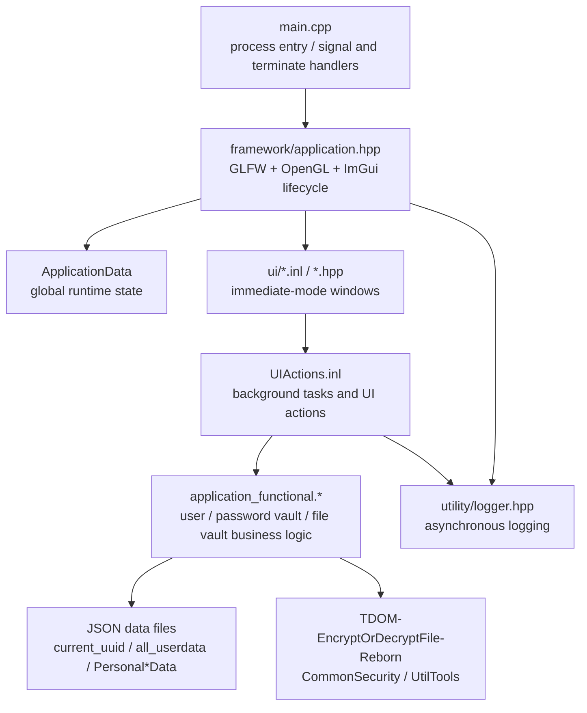
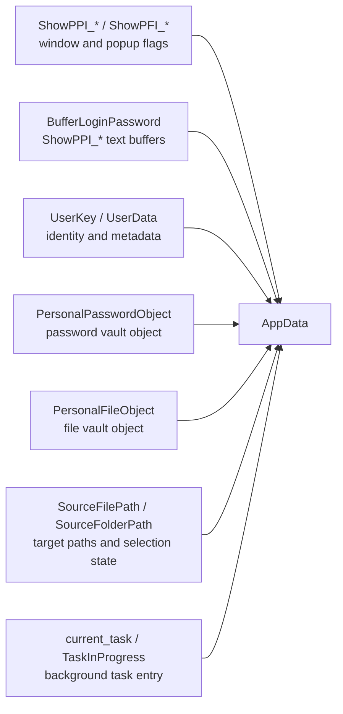
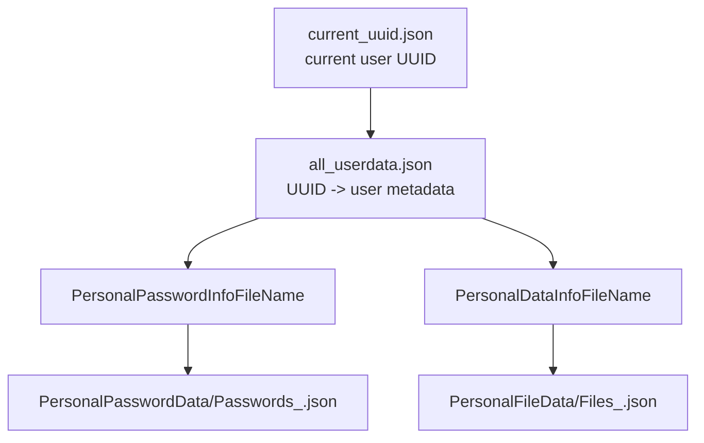
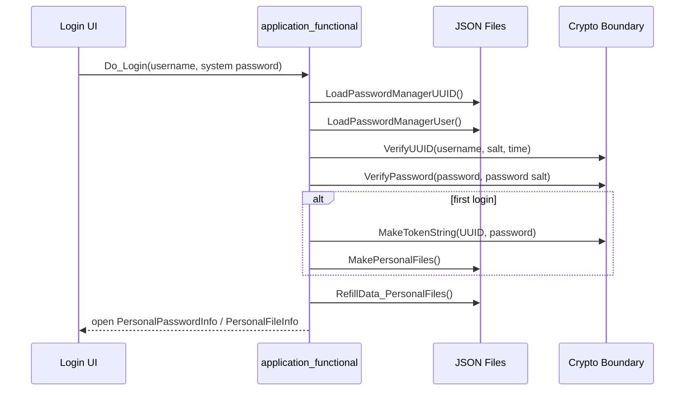
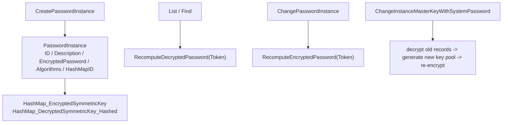
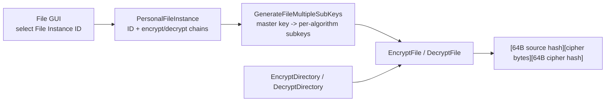
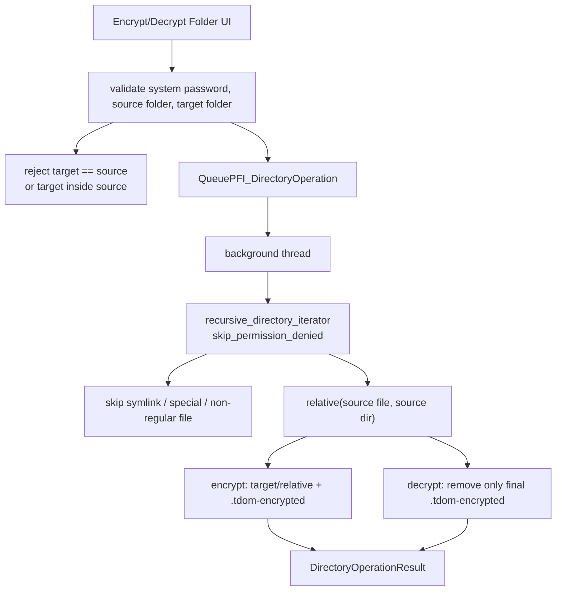
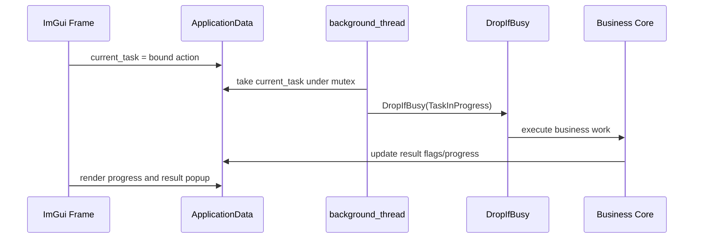
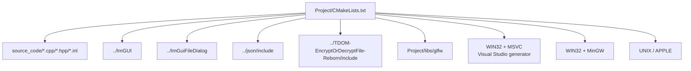

# PasswordManagerGUI Architecture

This document describes the GUI layer, business layer, runtime state, and data flow of PasswordManagerGUI. The self-developed cryptographic library `TDOM-EncryptOrDecryptFile-Reborn` is treated as an integration boundary: this project calls its hash, KDF/DRBG, block-cipher CTR, and formatting utilities, but this document does not audit its internal cryptographic implementation.

## 1. Layer View



| Layer | Main Files | Responsibility |
| --- | --- | --- |
| Process entry | `Project/source_code/main.cpp` | Initializes logging, installs `SIGABRT` and `std::terminate` handlers, and starts the application lifecycle. |
| Application framework | `framework/application.hpp` | Initializes GLFW/OpenGL/ImGui, loads the default docking layout, runs the main loop, owns the background `std::jthread`, and wipes sensitive GUI buffers during cleanup. |
| Global state | `core/application_data.hpp` | Stores window flags, text buffers, logged-in user data, password/file business objects, selected paths, background task state, and progress state. |
| Business core | `core/application_functional.hpp/.cpp` | Handles registration/login, token/master-key derivation, personal JSON file creation, password instance management, file instance management, single-file encryption, and folder encryption. |
| GUI windows | `ui/*.inl` | Renders ImGui windows, validates input, opens file/folder dialogs, shows result popups, and turns user actions into business actions. |
| Utilities | `utility/*.hpp` | Provides `DropIfBusy`, RAII cleanup/rollback helpers, and asynchronous logging. |
| Build layer | `Project/CMakeLists.txt` and `.bat` | Defines the C++20 target, third-party source files, and MSVC/MinGW/Linux/macOS linking branches. |

## 2. Runtime State Hub

`ApplicationData CurrentApplicationData` is the application's state hub. Dear ImGui is immediate-mode, so window visibility, input buffers, selected paths, and asynchronous task results are stored explicitly in this structure.



Important constraints:

- Before login, only registration and login are active. After a successful login, `Personal Password Info` and `Personal File Info` are opened.
- `BufferLoginPassword` is shared by multiple windows. After wiping it, the buffer must be resized back to `TEXT_BUFFER_CAPACITY`; otherwise ImGui receives a too-small input buffer.
- Logout closes password/file windows and resets `UserKey`, `UserData`, `PersonalPasswordObject`, `PersonalFileObject`, personal JSON paths, and file/folder selection state.
- `APP_Cleanup` uses `std::call_once` to avoid double-destroying ImGui/GLFW and wipes registration, login, and password-display buffers.

## 3. Persistent Data Layout



| File | Contents | Read/Write Sites |
| --- | --- | --- |
| `current_uuid.json` | Current user UUID. | Written during registration, read during login. |
| `all_userdata.json` | UUID, username, salts, registration time, hashed system password, personal file names, first-login flag. | Registration, login, first login, and system-password change. |
| `PersonalPasswordData/Passwords_*.json` | Password instances, encrypted instance-key pool, instance-key hashes. | `PersonalPasswordInfo::Serialization/Deserialization`. |
| `PersonalFileData/Files_*.json` | File instance IDs and algorithm-chain configuration. | `PersonalFileInfo::Serialization/Deserialization`. |

Personal data filenames are derived from the UUID by `GenerateStringFileUUIDFromStringUUID(UUID)`. `RefillData_FilePaths()` fills missing names for older data and keeps them consistent with the persisted `all_userdata.json` fields.

## 4. Login And Key Lifecycle



Key model:

- The login token is `UUID + system password`.
- `GenerateMasterBytesKeyFromToken(Token)` splits the token and calls the crypto library's `BuildingKeyStream<256>` path to obtain a 256-bit master key.
- Password instances use a separate instance-key pool. File instances do not persist per-file key pools; they persist only the algorithm order.
- File and folder workflows reuse the same login token and the same file-instance algorithm chain. They do not add per-file salt or per-file key pools.

## 5. Password Vault Architecture

`PersonalPasswordInfo` manages text password instances.



The algorithm chain is created from the GUI checkbox order. The encryption order is stored in `EncryptionAlgorithmNames`, and the decryption order is the reverse stored in `DecryptionAlgorithmNames`. Plaintext passwords are reconstructed only for list/find/display operations, and temporary plaintext is wiped when the relevant display state is closed.

## 6. File Vault Architecture

`PersonalFileInfo` manages binary files and folders.



Single-file encrypted format:

```text
offset 0..63        SHA3-512(source bytes)
offset 64..N-65     encrypted bytes
offset N-64..N-1    SHA3-512(encrypted bytes)
```

Single-file decryption first verifies the trailing ciphertext hash, then applies the file instance's decryption chain, then verifies the restored source hash. Empty files produce valid encrypted files containing only the two 64-byte hashes.

## 7. Folder Encryption Architecture



Directory APIs:

- `EncryptDirectory(Token, Instance, sourceDir, targetDir)`
- `DecryptDirectory(Token, Instance, sourceDir, targetDir)`

`DirectoryOperationResult` reports succeeded, failed, and skipped counts plus samples of failed/skipped paths. Traversal does not follow links and only processes regular files. Folder encryption keeps the key model unchanged: each file is processed by the existing `EncryptFile/DecryptFile` path, and the target folder preserves the source folder's relative layout.

## 8. UI And Background Tasks



The main loop renders windows every frame. Long-running operations are assigned to `current_task` and executed by the background `std::jthread` created in `APP_Initial`. `DropIfBusy` uses the `TaskInProgress` atomic flag to prevent concurrent jobs, and `SetProgressTarget` drives the progress bar.

## 9. Build And Platform Boundary



`CMakeLists.txt` uses `escape_cmake_glob_path()` so square brackets in the project path do not break CMake glob patterns. It keeps separate Windows MSVC, Windows MinGW, Linux, and macOS branches. New business code does not introduce implementation-dependent STL randomness into deterministic encryption paths; random salts, registration material, and temporary keys belong to identity/key-generation boundaries where reproducibility is not expected.

## 10. Architectural Boundaries And Invariants

- The GUI layer collects input, displays feedback, and schedules tasks; business rules live in `application_functional.*`.
- `Files_*.json` stores only file-instance algorithm configuration. It does not store per-file salts, per-file key pools, or directory manifests.
- Folder encryption is recursive single-file processing, not an archive/container format.
- Folder decryption processes only files ending with `.tdom-encrypted`; other regular files are counted as skipped.
- Cryptographic primitives are provided by `TDOM-EncryptOrDecryptFile-Reborn`; this project owns call order, data format, persistence, and GUI workflows.
