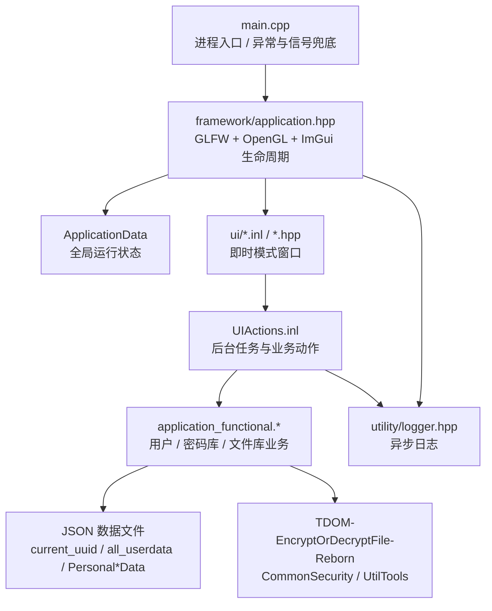
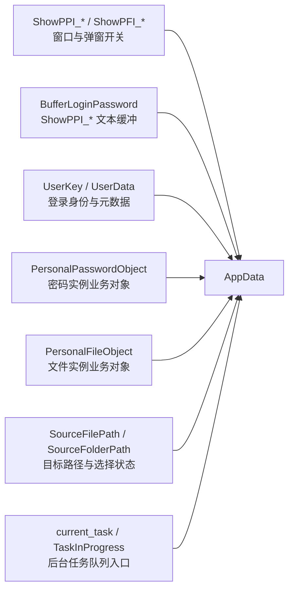
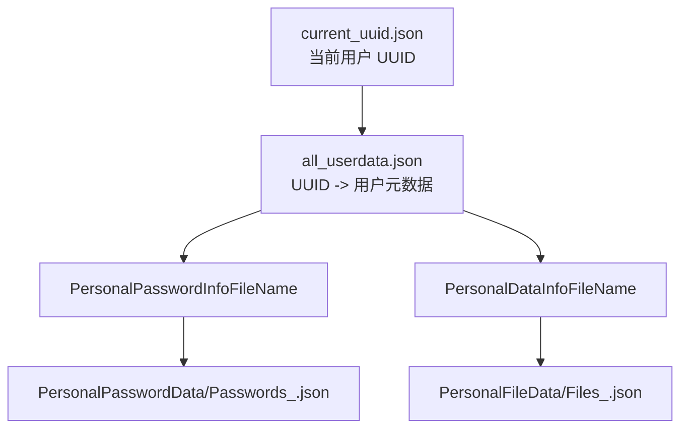
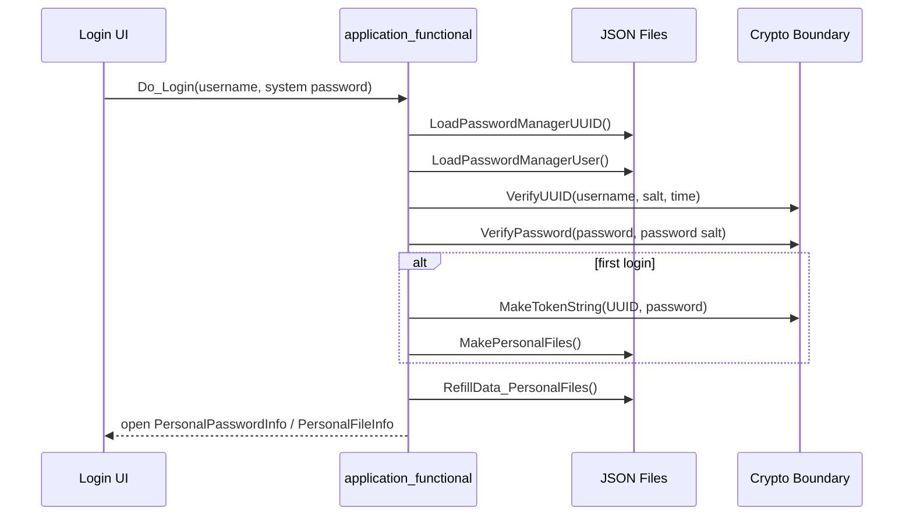
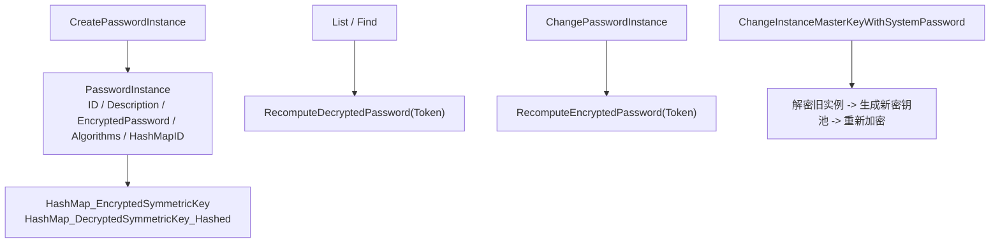
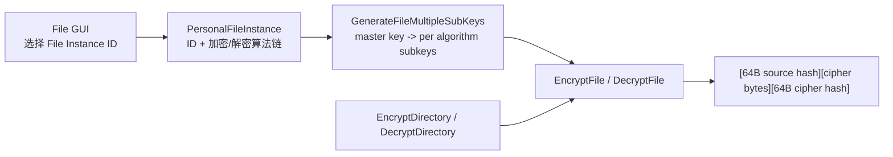
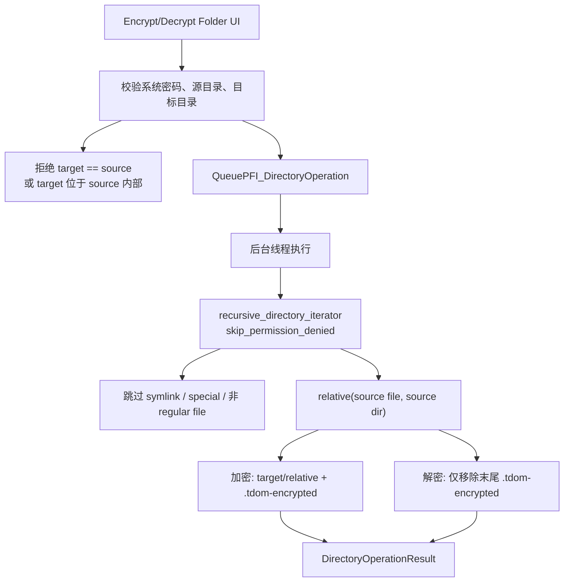
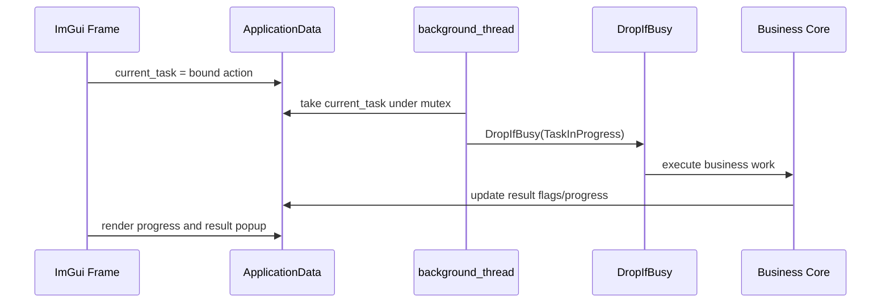
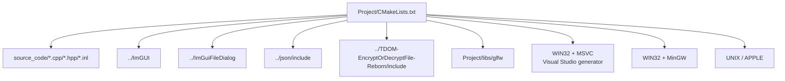

# PasswordManagerGUI 架构说明

本文只描述 PasswordManagerGUI 的 GUI 层、业务层、运行状态和数据流。自研密码库 `TDOM-EncryptOrDecryptFile-Reborn` 是外部集成边界：本项目调用它的哈希、KDF/DRBG、分组密码 CTR 模式和数据格式工具，但本文不展开审计其内部密码学实现。

## 1. 总体分层



| 层 | 主要文件 | 责任 |
| --- | --- | --- |
| 进程入口 | `Project/source_code/main.cpp` | 初始化日志，安装 `SIGABRT` 和 `std::terminate` 兜底，启动应用生命周期。 |
| 应用框架 | `framework/application.hpp` | 初始化 GLFW/OpenGL/ImGui，加载默认 docking 布局，运行主循环，管理后台 `std::jthread`，退出时清理敏感 GUI 缓冲区。 |
| 全局状态 | `core/application_data.hpp` | 保存所有窗口开关、文本缓冲、登录用户、个人密码库/文件库对象、路径选择状态、后台任务和进度条状态。 |
| 业务核心 | `core/application_functional.hpp/.cpp` | 用户注册登录、token/master key 生成、个人 JSON 文件创建、密码实例管理、文件实例管理、单文件和文件夹加解密。 |
| GUI 窗口 | `ui/*.inl` | ImGui 窗口、输入校验、文件/目录选择、结果弹窗、把用户操作转成业务动作。 |
| 工具层 | `utility/*.hpp` | `DropIfBusy` 防并发任务、RAII 清理/回滚、异步日志。 |
| 构建层 | `Project/CMakeLists.txt` 和 `.bat` | C++20 目标、第三方源码、MSVC/MinGW/Linux/macOS 链接分支。 |

## 2. 运行状态中心

`ApplicationData CurrentApplicationData` 是程序的状态中心。因为 GUI 使用 Dear ImGui 的即时模式，窗口显示、输入缓冲、选择路径和异步任务结果都显式保存在这个结构里。



关键约束：

- 登录前只允许注册、登录窗口工作；登录成功后打开 `Personal Password Info` 和 `Personal File Info`。
- `BufferLoginPassword` 会被多个窗口复用。清理后需要恢复到 `TEXT_BUFFER_CAPACITY`，否则 ImGui 输入框会拿到过小的缓冲区。
- logout 会关闭密码和文件相关窗口，重置 `UserKey`、`UserData`、`PersonalPasswordObject`、`PersonalFileObject`、个人 JSON 路径和文件/文件夹选择状态。
- `APP_Cleanup` 使用 `std::call_once` 防止重复释放 ImGui/GLFW，并擦除注册、登录和密码显示缓冲。

## 3. 持久化结构



| 文件 | 内容 | 读写位置 |
| --- | --- | --- |
| `current_uuid.json` | 当前用户 UUID。 | 注册时写入，登录时读取。 |
| `all_userdata.json` | UUID、用户名、密码盐、注册时间、哈希后的系统密码、个人文件名、首次登录标记。 | 注册、登录、首次登录、系统密码变更。 |
| `PersonalPasswordData/Passwords_*.json` | 密码实例、加密后的实例密钥池、实例密钥哈希。 | `PersonalPasswordInfo::Serialization/Deserialization`。 |
| `PersonalFileData/Files_*.json` | 文件实例 ID 和算法链配置。 | `PersonalFileInfo::Serialization/Deserialization`。 |

文件名由 `GenerateStringFileUUIDFromStringUUID(UUID)` 从 UUID 派生。`RefillData_FilePaths()` 会补齐旧数据缺失的个人文件名，并与 `all_userdata.json` 持久化字段保持一致。

## 4. 登录与密钥生命周期



密钥模型：

- 登录 token 是 `UUID + 系统密码`。
- `GenerateMasterBytesKeyFromToken(Token)` 把 token 拆分后交给密码库的 `BuildingKeyStream<256>`，得到 256-bit master key。
- 密码实例使用独立实例密钥池；文件实例不保存文件专属 key pool，只保存算法顺序。
- 文件和文件夹功能沿用同一登录 token 和同一文件实例算法链，不新增每文件 salt 或每文件密钥池。

## 5. 密码库架构

`PersonalPasswordInfo` 负责文本密码实例。



密码实例的算法链由 GUI 勾选顺序生成，加密顺序保存到 `EncryptionAlgorithmNames`，解密顺序保存为反向的 `DecryptionAlgorithmNames`。显示、查找、列出时才把密文解回临时明文；窗口关闭或取消显示时会擦除临时明文。

## 6. 文件库架构

`PersonalFileInfo` 负责二进制文件和文件夹。



单文件加密结构：

```text
offset 0..63        SHA3-512(source bytes)
offset 64..N-65     encrypted bytes
offset N-64..N-1    SHA3-512(encrypted bytes)
```

单文件解密会先验证尾部密文哈希，再按文件实例的解密算法链处理数据，最后验证解密后的源文件哈希。空文件会生成只包含两个 64 字节哈希的合法密文。

## 7. 文件夹加解密架构



目录级 API：

- `EncryptDirectory(Token, Instance, sourceDir, targetDir)`
- `DecryptDirectory(Token, Instance, sourceDir, targetDir)`

返回值 `DirectoryOperationResult` 包含成功、失败、跳过数量，以及失败/跳过路径样本。目录遍历不跟随链接，只处理 regular file。文件夹加密不会改变密钥模型：每个文件仍调用现有 `EncryptFile/DecryptFile`，输出目录保留源目录相对结构。

## 8. UI 与后台任务



主循环每帧渲染窗口。耗时操作通过 `current_task` 交给 `APP_Initial` 创建的后台 `std::jthread`。`DropIfBusy` 使用 `TaskInProgress` 原子标志避免同时执行多个任务，`SetProgressTarget` 给进度条提供平滑目标。

## 9. 构建与平台边界



`CMakeLists.txt` 使用 `escape_cmake_glob_path()` 避免当前工程路径中的方括号破坏 CMake glob 模式；同时保留 Windows MSVC、Windows MinGW、Linux/macOS 分支。新增业务代码不引入实现相关的 STL 随机分布作为确定性加密路径的一部分；盐、注册材料、临时密钥等不可复现随机性属于身份/密钥生成边界。

## 10. 架构边界与不变量

- GUI 层只负责收集输入、显示反馈、安排任务；业务规则落在 `application_functional.*`。
- `Files_*.json` 只保存文件实例算法配置，不保存每文件 salt、每文件 key pool 或目录 manifest。
- 文件夹加密是“逐文件递归调用单文件格式”，不是 archive/container 格式。
- 解密文件夹只处理末尾带 `.tdom-encrypted` 的文件；其他 regular file 计入 skipped。
- 密码学细节由 `TDOM-EncryptOrDecryptFile-Reborn` 提供，本项目只约束调用顺序、数据格式、持久化和 UI 工作流。
