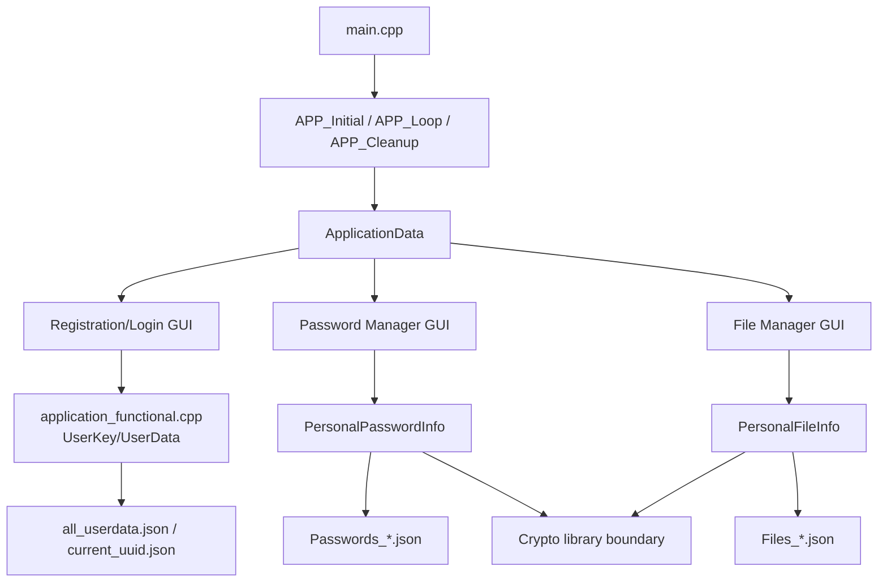
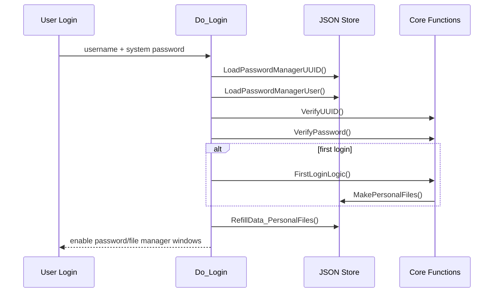
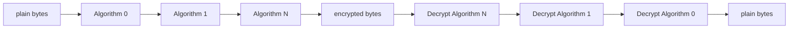
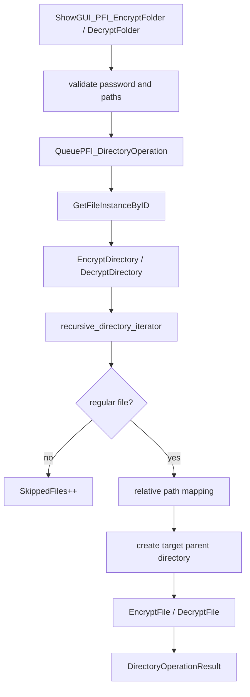

# PasswordManagerGUI Engineering Paper

## Abstract

PasswordManagerGUI is a local, offline GUI project for symmetric password and data management. Its goal is not to wrap a single cipher into a small utility, but to build a maintainable engineering structure around login identity, personal data files, text password records, binary file records, folder batch processing, immediate-mode GUI state, and background tasks. The current project uses C++20, Dear ImGui, GLFW, OpenGL, nlohmann/json, and the self-developed cryptographic library `TDOM-EncryptOrDecryptFile-Reborn`. The business layer treats `UUID + system password` as the login token material and derives a master key from it. The password vault stores text password records and an instance-key pool. The file vault stores file algorithm configuration and encrypts/decrypts either one regular file or every regular file in a folder tree. This paper explains the engineering structure, module collaboration, persistent data layout, folder encryption design, testing strategy, and current boundaries. The cryptographic core itself is treated as an external integration boundary rather than audited here.

**Keywords**: C++20; Dear ImGui; local password manager; file encryption; recursive folders; JSON persistence; asynchronous tasks; cross-platform engineering

## 1. Introduction

The project started as a local Password and Data Manager: a tool that can protect symmetric security material without relying on a cloud service or a paid platform. Storing text passwords covers only part of that goal. Real user data also includes binary files, folder trees, configuration bundles, private documents, and other data that should be encrypted as files.

The application therefore supports two business domains:

- Text password records: each record has a description, ciphertext, algorithm chain, and instance-key mapping. It can be created, changed, listed, searched, and deleted after login.
- File data records: each record stores an algorithm chain and can encrypt/decrypt a single binary file or every regular file in a folder tree.

Both domains share login identity and master-key material, but their persistence models differ. The password vault persists an encrypted instance-key pool. The file vault persists only algorithm-chain configuration; it does not add per-file salts, per-file key pools, or directory manifests. This keeps the recovery model simple: if the user carries the identity JSON, the personal password JSON, the personal file-configuration JSON, and the encrypted data files, the data can be accessed again under the same deterministic cryptographic-library behavior.

This paper does not analyze the internal security of `TDOM-EncryptOrDecryptFile-Reborn`. Its focus is the GUI/business integration: call boundaries, data formats, UI workflows, background tasks, and cross-platform build structure.

## 2. Requirements

### 2.1 Functional Requirements

1. A user can register a local identity, producing `current_uuid.json` and `all_userdata.json`.
2. A user can log in and log out; personal password/file windows are available only after login.
3. First login automatically creates `PersonalPasswordData/Passwords_*.json` and `PersonalFileData/Files_*.json`.
4. The password vault supports create, change, list, find by ID, find by description, delete, delete all, and system-password change.
5. The file vault supports create/list/delete file instances and single-file encryption/decryption through a selected instance.
6. The file vault supports recursive folder encryption/decryption while preserving relative folder structure.
7. Encrypted folder output appends `.tdom-encrypted`; decryption removes only that final suffix.
8. The UI shows input validation, password validation, task progress, and result summaries.

### 2.2 Non-Functional Requirements

1. The application is local and offline.
2. Deterministic encryption paths must avoid implementation-dependent randomness.
3. The GUI thread should not be blocked by long operations; folder processing should run as a background task.
4. Sensitive buffers should be wiped after logout, cleanup, and temporary plaintext display.
5. The build must handle Windows MSVC, Windows MinGW, Linux/macOS, and square brackets in the project path.

## 3. Project Structure

```text
PasswordManagerGUI/
├─ README.md
├─ docs/
│  ├─ README.md
│  ├─ architecture.md
│  ├─ architecture.en.md
│  ├─ engineering-paper.md
│  └─ engineering-paper.en.md
├─ Project/
│  ├─ CMakeLists.txt
│  ├─ build_win32.bat
│  ├─ generate_visual_studio_project_with_cmake.bat
│  ├─ libs/glfw/
│  └─ source_code/
│     ├─ main.cpp
│     ├─ framework/application.hpp
│     ├─ core/application_data.hpp
│     ├─ core/application_functional.hpp
│     ├─ core/application_functional.cpp
│     ├─ ui/CommonUIComponent.hpp
│     ├─ ui/PasswordManagerGUI.hpp
│     ├─ ui/UIActions.inl
│     ├─ ui/PasswordEncryptionUI.inl
│     ├─ ui/FileEncryptionUI.inl
│     ├─ ui/imgui_layout.inl
│     └─ utility/*.hpp
├─ ImGUI/
├─ ImGuiFileDialog/
├─ json/
└─ TDOM-EncryptOrDecryptFile-Reborn/
```

The project's own business code lives under `Project/source_code`. External directories provide the GUI, file dialog, JSON, and cryptographic dependencies. `TDOM-EncryptOrDecryptFile-Reborn` is used as a cryptographic service boundary; the GUI project does not duplicate its algorithm implementations.

## 4. Overall Design



The project uses a framework main loop, a global state object, domain objects, and JSON persistence. `APP_Loop` renders every visible window each frame. All window state is stored in `ApplicationData`. Button callbacks do not run heavy work directly; they enqueue a bound function in `current_task`, and the background thread executes it. Business objects serialize JSON files and call the cryptographic library.

This design matches Dear ImGui's immediate-mode model. ImGui does not own traditional widget objects, so window visibility, input text, popup state, selected paths, and operation results must be stored explicitly. The many `ShowPPI_*`, `ShowPFI_*`, and `Is*Selected` flags are the cost of the immediate-mode UI approach and a known source of code bulk.

## 5. Application Lifecycle

`main.cpp` has three main responsibilities:

1. Initialize logging with `Logger::Instance().Init()`.
2. Install `SIGABRT` and `std::set_terminate` handlers that write fatal logs and call `APP_Cleanup(CurrentApplicationData)`.
3. Use `ScopeGuard` to ensure cleanup runs on the normal path as well.

`framework/application.hpp` owns the runtime lifecycle:

- `ImGUI_Inital()` initializes GLFW, OpenGL, the ImGui context, docking, multi-viewport mode, and the default layout.
- `APP_Initial()` starts the background `std::jthread` that polls `ApplicationData::current_task`.
- `APP_Loop()` runs the main loop, approximately targets 60 FPS, and renders registration, login, password-vault, file-vault, and progress windows.
- `APP_Cleanup()` shuts down ImGui/GLFW and wipes sensitive GUI buffers.

This keeps the entry layer small, centralizes graphics lifecycle in the framework layer, and prevents business code from depending on OpenGL or GLFW details.

## 6. Identity And Master-Key Lifecycle

### 6.1 Registration

The registration window collects a username and a system password. Registration generates two salts:

- `RandomSalt`, used by UUID generation.
- `RandomPasswordSalt`, used by system-password hashing.

`GenerateUUID()` derives the UUID from username, salt, and registration time. `PasswordAndHash()` hashes the salted system password. `SavePasswordManagerUser()` writes metadata to `all_userdata.json` and writes the current UUID to `current_uuid.json`.

### 6.2 Login

Login is implemented by `Do_Login()`:



On first login, `FirstLoginLogic()` derives personal data filenames from the UUID and creates:

- `PersonalPasswordData/Passwords_<file_uuid>.json`
- `PersonalFileData/Files_<file_uuid>.json`

Then `RefillData_PersonalFiles()` deserializes those files into `PersonalPasswordObject` and `PersonalFileObject`.

### 6.3 Token And Master Key

The core login material is:

```text
Token = UUID + system password
MasterKey = GenerateMasterBytesKeyFromToken(Token)
```

`GenerateMasterBytesKeyFromToken()` splits the token and passes it to the cryptographic library's `BuildingKeyStream<256>` path, producing a 32-byte master key. The two vaults use this model differently:

- Password vault: the master key protects and rebuilds the instance-key pool.
- File vault: the master key is expanded into per-algorithm subkeys for a file instance.

### 6.4 Logout

`Do_LogoutPersonalPasswordInfo()` is the main business-state cleanup point. It closes password/file windows, resets the user objects and business objects, clears personal JSON paths, wipes the login-password buffer, and clears file/folder path selection state. This prevents the next session from inheriting stale paths, result popups, or temporary plaintext.

## 7. Password Vault Design

`PersonalPasswordInfo` manages `PersonalPasswordInstance`:

```text
ID
Description
EncryptedPassword
DecryptedPassword
EncryptionAlgorithmNames
DecryptionAlgorithmNames
HashMapID
```

The password vault also owns two maps:

- `HashMap_EncryptedSymmetricKey`
- `HashMap_DecryptedSymmetricKey_Hashed`

During first login, `RegenerateMasterKey()` generates an instance-key pool, protects each instance key with the master key, and stores the encrypted key plus a hash of the plaintext key. When a password record is created, it chooses a `HashMapID` and `RecomputeEncryptedPassword()` encrypts the text password through the selected algorithm chain into a Base64 string.

Main password workflows:

| Workflow | UI File | Business Function |
| --- | --- | --- |
| Create password | `PasswordEncryptionUI.inl` | `Do_CreatePasswordInstance()` -> `CreatePasswordInstance()` |
| Change password | `PasswordEncryptionUI.inl` | `Do_ChangePasswordInstance()` -> `ChangePasswordInstance()` |
| List all | `PasswordEncryptionUI.inl` | `Do_DecryptionAllPasswordInstance()` -> `ListAllPasswordInstance()` |
| Find by ID | `PasswordEncryptionUI.inl` | `Do_FindPasswordInstanceByID()` -> `FindPasswordInstanceByID()` |
| Find by description | `PasswordEncryptionUI.inl` | `Do_FindPasswordInstanceByDescription()` -> `FindPasswordInstanceByDescription()` |
| Delete | `PasswordEncryptionUI.inl` | `RemovePasswordInstance()` / `RemoveAllPasswordInstance()` |
| Change system password | `PasswordEncryptionUI.inl` | `ChangeInstanceMasterKeyWithSystemPassword()` |

Changing the system password is the heaviest password-vault workflow. The code decrypts all existing records with the old token, clears the old records and key maps, generates a new instance-key pool with the new token, recreates every password record, and serializes the result. This confirms that the system password is not merely a login check; it is part of the master-key material.

## 8. File Vault Design

`PersonalFileInfo` manages `PersonalFileInstance`:

```text
ID
EncryptionAlgorithmNames
DecryptionAlgorithmNames
```

File instances store algorithm chains only. They do not store paths, per-file keys, or salts. The GUI checkboxes for AES, RC6, SM4, Twofish, and Serpent define the encryption order, while the reverse order becomes the decryption chain.

### 8.1 Subkey Generation

`GenerateFileMultipleSubKeys()` starts from the master key derived from the login token and produces 256-bit subkeys for the selected algorithm chain. The current implementation has two paths:

- If both encryption and decryption chains contain at most four algorithms, the Base64 master key is split into four strings and a hash-token path generates the key stream.
- Otherwise, an HMAC DRBG produces fixed-size subkeys.

This is business-layer orchestration over the cryptographic library. Determinism matters: the same token, same algorithm chain, and same cryptographic-library implementation should produce the same subkeys.

### 8.2 Single-File Format

Single-file encryption reads the whole source file into `std::vector<uint8_t>`, computes a source hash, applies the cascade algorithm chain, computes a ciphertext hash, and writes:

```text
[64 bytes source hash][encrypted bytes][64 bytes encrypted hash]
```

Decryption reverses the process. It splits the header source hash, ciphertext bytes, and trailing ciphertext hash; verifies the ciphertext hash; applies the decryption chain; then verifies the restored source hash. This gives the business layer basic integrity checking and allows an empty file to be represented as a valid encrypted file with two hashes and zero ciphertext bytes between them.

### 8.3 Cascade Model

The project's cascade model is not an AEAD cascade container or a fixed algorithm suite. It is the order selected by the user in the GUI and persisted by the file instance:



The business layer's responsibility is to dispatch by algorithm name and call the algorithms in the stored order. The exact CTR-mode function semantics belong to the cryptographic-library boundary.

## 9. Folder Encryption And Decryption

Folder support intentionally reuses the single-file API instead of creating a new archive or container format.



Implementation details:

- Traversal uses `std::filesystem::recursive_directory_iterator` with `skip_permission_denied`, and uses `increment(error_code)` to handle traversal errors.
- `symlink_status()` is used to skip symlinks, while `status()` confirms that only regular files are processed.
- Encryption maps `source/a/b.txt` to `target/a/b.txt.tdom-encrypted`.
- Decryption processes only files ending in `.tdom-encrypted` and outputs `target/a/b.txt`.
- The target directory must not be the same as the source directory and must not be inside the source directory. This prevents the output from being recursively processed as input.
- `DirectoryOperationResult` stores succeeded, failed, and skipped counts plus path samples for the result popup.

This preserves the existing key model. Every file in the folder is processed with the same selected file instance and the same login token; the folder workflow does not introduce per-file salt or per-file key pools.

## 10. GUI Implementation

The GUI is split across several files:

- `PasswordManagerGUI.hpp`: registration and login windows.
- `PasswordEncryptionUI.inl`: password-record windows.
- `FileEncryptionUI.inl`: file and folder windows.
- `CommonUIComponent.hpp`: progress bar, password validation text, algorithm checkbox group, file/folder dialog helpers.
- `UIActions.inl`: turns button actions into business tasks.

Most UI validation has two layers:

1. The window shows live feedback, for example `VerifyPasswordText(correct_password)`.
2. The button handler checks the same conditions again before calling business logic.

File and folder selection are wrapped in template helpers:

- `FileDialogCallback()` uses `GetFilePathName()` to obtain a concrete file path.
- `DirectoryDialogCallback()` uses `GetCurrentPath()` to obtain the selected directory and passes `nullptr` as the filter.

This moves ImGuiFileDialog boilerplate out of the business windows and keeps each window focused on its own workflow.

## 11. Background Tasks And Progress

The background task model is stored in `ApplicationData`:

```text
std::atomic_bool TaskInProgress
std::mutex mutex_task
std::optional<std::function<void()>> current_task
std::optional<std::jthread> background_thread
float progress
float progress_target
float progress_life_time
```

`APP_Initial()` creates the background thread. The thread checks `current_task` in a loop and executes the task when one is present. The UI-side `Do_*` functions enqueue a bound function when `!TaskInProgress`. At execution time, `DropIfBusy()` uses `TaskInProgress.compare_exchange_strong()` as a second guard and a `ScopeGuard` to reset the busy flag when the task exits.

`Show_ProgressBar()` renders the progress window every frame. Business tasks call `SetProgressTarget()` to update a target value, and the UI smoothly approaches the target. This is not byte-accurate file progress; it is a responsive task-state indicator.

## 12. Logging System

`utility/logger.hpp` implements a singleton asynchronous logger. Its design includes:

- Log levels: DEBUG, INFO, NORMAL, NOTICE, WARNING, ERROR, FATAL.
- Mask flags for time, source location, function name, color, tag, message, console output, and file output.
- Helper-chain syntax such as `Logger::Instance().Notice().Log(...)`.
- `std::source_location` capture for call-site context.
- Synchronous output for FATAL logs and asynchronous buffering for normal logs.
- Default console and file sinks; the file sink can roll log files by size.

The logger has two roles in this project: it helps diagnose GUI/business errors during development, and it records context during abnormal termination. It is not part of key persistence and should not log sensitive plaintext.

## 13. Build And Cross-Platform Engineering

`Project/CMakeLists.txt` is the main build entry. It adds `main.cpp` explicitly, recursively collects `.h/.hpp/.inl/.cpp` under `source_code`, and adds ImGui, ImGui backend, and ImGuiFileDialog source files.

A notable engineering detail is:

```cmake
function(escape_cmake_glob_path output_variable input_path)
    string(REPLACE "\\" "/" escaped_path "${input_path}")
    string(REPLACE "[" "[[]" escaped_path "${escaped_path}")
    set(${output_variable} "${escaped_path}" PARENT_SCOPE)
endfunction()
```

The project path contains square brackets, and CMake glob patterns treat `[` as pattern syntax. The path must therefore be escaped before `file(GLOB_RECURSE ...)`.

Platform branches:

- Windows + MSVC: Visual Studio generator, bundled MSVC GLFW library, `/utf-8`, `/bigobj`, and C++20-related options.
- Windows + MinGW: searches for a MinGW-compatible GLFW library.
- Linux: uses `pkg-config` to find glfw3.
- macOS: links OpenGL plus Cocoa, IOKit, and CoreVideo frameworks.

Cross-platform determinism is an engineering constraint. Some C++ STL APIs have the same interface but implementation-dependent behavior. Deterministic encryption paths must therefore avoid relying on implementation-defined randomness. Registration salts, password salts, and temporary keys are intentionally non-reproducible random material; but any derivation path needed to decrypt data on another machine must remain deterministic.

## 14. Data-Security Boundary

The current business layer provides the following protections:

- Login validates both UUID and system password.
- The system password is not stored directly; a salted hash is stored.
- The master key is derived from `UUID + system password`, so personal data requires a successful login.
- Password plaintext exists only temporarily during display or re-encryption and is wiped in several code paths.
- Single-file ciphertext stores both source-data and ciphertext hashes, and decryption verifies both stages.
- Logout and cleanup wipe multiple GUI buffers.

The boundaries are also explicit:

- Cryptographic strength depends on `TDOM-EncryptOrDecryptFile-Reborn`; this paper is not a substitute for cryptographic review.
- The single-file format is not an archive and does not contain a directory manifest.
- Single-file processing currently reads the entire file into memory, so very large files are memory-bound.
- Folder operations continue per file. A failed file does not roll back already completed files.

## 15. Feature-Level Implementation And Security Notes

This section describes the visible features one by one. Its purpose is to make the engineering intent clear: what each feature accepts as input, what runtime state it changes, what it persists, what it validates, which randomness is intentionally non-reproducible, and which paths must stay deterministic.

### 15.1 Registration

Registration starts in `ApplicationUserRegistration()`. The GUI collects `BufferRegisterUsername` and `BufferRegisterPassword`. When the Register button is pressed, trailing `'\0'` padding is removed. If either field is empty, the UI opens a failure popup and no user data is written.

The successful path is:

1. Call `GenerateRandomSalt()` to create `RandomSalt`.
2. Call `GenerateRandomSalt()` again to create `RandomPasswordSalt`.
3. Call `GenerateUUID(username, RandomSalt, RegistrationTime, UUID)`.
4. Call `PasswordAndHash(password, RandomPasswordSalt)` to derive the stored system-password hash.
5. Call `SavePasswordManagerUser()` to write `all_userdata.json`, and write `current_uuid.json` for a new user.
6. Wipe the registration input buffers with `memory_set_no_optimize_function<0x00>()`.

The salts and registration time are identity-initialization material and are intentionally not reproducible. They are not meant to let a different machine recreate the same new user. Cross-platform reproducibility mainly constrains post-login derivation and decryption paths, not the random salts used during registration.

`GenerateUUID()` uses the username, `RandomSalt`, and `RegistrationTime` in an HMAC-style computation configured with the `CHINA_SHANG_YONG_MI_MA3` hash mode. The result is converted to bytes and Base64 encoded. `GenerateStringFileUUIDFromStringUUID()` compresses the UUID to 20 bytes and converts it to hexadecimal so it can be used as part of personal JSON filenames. This gives identity and personal data files a stable relationship without using the raw UUID directly as a filename.

### 15.2 Login, Authentication, And Timing-Attack Resistance

Login starts in `ApplicationUserLogin()`, with business logic in `Do_Login()`. The login path trims input buffers, then loads current user material from `current_uuid.json` and `all_userdata.json`. Authentication has two parts:

- `VerifyUUID()` recomputes the UUID from the typed username, saved `RandomSalt`, and saved `RegistrationTime`, then compares it with the UUID from `current_uuid.json`.
- `VerifyPassword()` hashes the typed system password with `RandomPasswordSalt`, then compares it with the stored `HashedPassword` from `all_userdata.json`.

The timing-attack relevant detail is in `VerifyPassword()`. The code does not return early when the first differing character is found. For equal-length hashes, it walks the whole hash string and accumulates the comparison result:

```cpp
bool isSame = true;
for(size_t Index = 0; Index < HashedPassword.size(); ++Index)
{
    isSame &= ~static_cast<bool>(HashedPassword[Index] ^ CurrentUserData.HashedPassword[Index]);
}
return isSame;
```

This is an engineering-level constant-work digest comparison: under normal data, the BLAKE2-512 hexadecimal hash length is fixed, and the comparison covers the entire digest instead of leaking the length of a matching prefix. The function returns false early when lengths differ; that is a format boundary. The stored password hash should have a fixed length, so a length mismatch indicates corrupted or invalid stored data rather than a password-character guessing path. In a strict cryptographic sense, formal constant-time behavior can still depend on compiler optimization, runtime platform, and string representation; the accurate claim is that this code avoids first-mismatch early exit.

After successful login, if `IsFirstLogin` is true, the program calls `FirstLoginLogic()` to create personal password and file JSON files. Then `RefillData_PersonalFiles()` deserializes both business objects and opens the password/file manager windows. At the end of login, `BufferLoginPassword` is wiped so the system password does not remain in the login input buffer.

### 15.3 First Login And Personal Data Files

First login connects a user identity to personal data files. `FirstLoginLogic()` derives `UniqueFileName` from the current UUID and creates:

```text
PersonalPasswordData/Passwords_<UniqueFileName>.json
PersonalFileData/Files_<UniqueFileName>.json
```

`MakePersonalFiles()` ensures parent directories exist, then creates both files. The password JSON is initialized after `RegenerateMasterKey()` creates the password instance-key pool. The file JSON is initialized with an empty `PersonalFileInfo`, because file instances do not store per-file key pools.

`SavePasswordManagerUser()` writes `PersonalPasswordInfoFileName` and `PersonalDataInfoFileName` back to `all_userdata.json`. This matters for recovery: login does not need to scan directories or guess filenames; it reads the filenames from user metadata.

### 15.4 Logout And Sensitive State Cleanup

Logout is handled by `Do_LogoutPersonalPasswordInfo()`. It does more than set `IsUserLogin` to false; it clears the whole session state:

- Closes `ShowGUI_PersonalPasswordInfo` and `ShowGUI_PersonalFileInfo`.
- Resets `UserKey`, `UserData`, `PersonalPasswordObject`, and `PersonalFileObject`.
- Clears `PersonalPasswordInfoFilePath` and `PersonalDataInfoFilePath`.
- Wipes `BufferLoginPassword`.
- Closes all password-vault and file-vault subwindows.
- Clears single-file and folder path selections.
- Clears folder-operation error messages and the previous directory operation result.

This prevents two classes of leakage: a later user seeing the previous user's UI state, and stale result popups, selected paths, or temporary plaintext crossing session boundaries.

### 15.5 Password Record Creation

The password-record creation window validates three inputs:

- The system password must pass `VerifyPassword()`.
- The new password text must not be all `'\0'`.
- At least one algorithm must be selected.

Algorithm selection is read by `ShowEncryptionAlgorithmGroup()` from the AES, RC6, SM4, Twofish, and Serpent checkboxes. Creation stores the selected order in `ShowPPI_EncryptionAlgorithms`, then uses `std::reverse_copy()` to create `ShowPPI_DecryptionAlgorithms`. The user-facing order is therefore the encryption order, and the business layer persists the reverse order for decryption.

`Do_CreatePasswordInstance()` runs a background task that calls `PersonalPasswordInfo::CreatePasswordInstance()`. The new ID is the last current ID plus one. `HashMapID` selects an entry from the existing instance-key pool. `RecomputeEncryptedPassword()` decrypts the selected instance key, verifies the instance-key hash, encrypts the new password through the algorithm chain, and Base64 encodes the result. The password JSON is serialized immediately after creation, and temporary password, description, and algorithm arrays are cleared.

There are two kinds of randomness here:

- The instance-key pool is generated during first login or system-password migration and is persisted as protected secret material.
- Selecting a `HashMapID` for a new password record can be non-deterministic because the selected ID is persisted with the record; later decryption does not need to repeat the random choice.

### 15.6 Password Record Modification

The modification window accepts a target ID, description, new password, algorithm selection, and the `ShowPPI_ChangeEncryptedPassword` switch. The switch decides whether the ciphertext is recomputed. If only the description changes, the original ciphertext and algorithm chain can remain. If the password or algorithm chain changes, the ciphertext must be rebuilt.

`Do_ChangePasswordInstance()` requires a correct system password, non-empty new password, and non-empty algorithm chain. `ChangePasswordInstance()` finds the record by ID and returns false if it does not exist. If it is found, the function updates the description and algorithm chains and calls `RecomputeEncryptedPassword()` when needed. On success, the JSON is serialized and `IsPasswordInfoTemporaryValid` is invalidated so list windows cannot keep showing stale decrypted data.

### 15.7 Listing And Searching Password Records

Listing all records requires the system password. Only after password validation does `Do_DecryptionAllPasswordInstance()` call `ListAllPasswordInstance(Token)`. That function calls `RecomputeDecryptedPassword()` for every record and stores temporary plaintext in memory for display.

The security boundary is clear: display requires temporary plaintext. Therefore, when the list window is hidden or `List All` is disabled, the code walks the records, wipes `DecryptedPassword` with `memory_set_no_optimize_function<0x00>()`, and clears it. Find-by-ID and find-by-description write formatted output into fixed buffers; closing or hiding the popup clears those buffers.

Search operations do not modify JSON. They only decrypt temporarily and display the result. Create, modify, and delete operations are the ones that serialize persistent state.

### 15.8 Password Record Deletion And Delete-All

Deleting one password record requires the system password. When the Delete button is pressed, the UI calls `VerifyPassword()`. Only if the password is correct and `RemovePasswordInstance(ID)` succeeds does the code serialize JSON. After deletion, remaining IDs are compacted so IDs match the current vector order.

Deleting all password records also requires the system password. On success, `RemoveAllPasswordInstance()` is called and the JSON is serialized. This deletes password records, not the user identity and not the `HashMap_EncryptedSymmetricKey` key pool. The key pool remains available for future password records.

### 15.9 System-Password Change

Changing the system password is sensitive because the system password contributes to the token and therefore to the master key. The window asks for the old system password, confirmation of the old password, and a new system password.

`Do_ChangeInstanceMasterKeyWithSystemPassword()` applies several checks:

- The old system password must pass `VerifyPassword()`.
- The confirmation password must match the current login password.
- The new password must differ from the old password.

After validation, the business layer calls `ChangeInstanceMasterKeyWithSystemPassword(FilePath, OldToken, NewToken)`. That function decrypts all existing password records with the old token, saves descriptions and algorithm chains, clears old records and old key maps, generates a new instance-key pool with the new token, recreates every password record, and serializes the result. Temporary old plaintext and instance plaintext are wiped during the process.

This workflow currently covers the password vault. File encryption material is also derived from `UUID + system password`, so old files are not automatically decryptable with a new system password unless a file-key migration layer or stable file-key protection layer is designed. That should be treated as a separate design task, not a UI-only change.

### 15.10 File Instance Creation, Listing, And Deletion

File instances differ from password records. They store only algorithm chains:

```text
ID
EncryptionAlgorithmNames
DecryptionAlgorithmNames
```

Creating a file instance does not generate a secret key and does not bind a concrete file path. The `Token` parameter of `CreateFileInstance()` is currently not used internally; the instance simply tells later file operations which algorithm order to use. Therefore `Files_*.json` stays lightweight: it is a file-encryption configuration table, not a key database.

Listing file instances displays IDs and algorithm chains. Deleting a file instance deletes configuration only. It does not delete existing `.tdom-encrypted` files and does not erase user source or target files from disk. After deletion, IDs are compacted so ID lookup matches the current list.

### 15.11 Single-File Encryption

The single-file encryption window requires:

- Correct system password.
- Selected source file path.
- Selected encrypted output path.
- A valid file instance ID.

`FileDialogCallback()` selects concrete file paths. After the Encrypt button passes `VerifyPassword()`, it calls `PersonalFileInfo::EncryptFile(Token, Instance, SourceFilePath, TargetEncryptedFilePath)`.

`EncryptFile()` performs these steps:

1. Confirms the source path is a regular file with `std::filesystem::is_regular_file()`.
2. Confirms encryption and decryption chains are non-empty and have equal length.
3. Reads the whole file as binary into memory.
4. Computes the SHA3-512 hash of the source bytes.
5. Derives the master key from the token.
6. Generates subkeys from the file instance algorithm chain.
7. Applies each algorithm in `EncryptionAlgorithmNames` order through the corresponding CTR stream function.
8. Computes the SHA3-512 hash of the ciphertext bytes.
9. Writes `[source hash][cipher bytes][cipher hash]`.
10. Wipes the master key and subkeys.

Empty files are not rejected. Their `FileByteData` is empty, so the algorithm loop is skipped, but source and ciphertext hashes are still written. The output is therefore a valid 128-byte structure.

### 15.12 Single-File Decryption

The single-file decryption window requires a correct system password, selected encrypted input path, selected decrypted output path, and a valid file instance ID. The Decrypt button calls `DecryptFile()`.

`DecryptFile()` has two hash checkpoints:

1. The encrypted file must be at least 128 bytes so it can contain two SHA3-512 hashes.
2. The first 64 bytes are read as the source hash.
3. The middle bytes are read as ciphertext.
4. The last 64 bytes are read as the ciphertext hash.
5. The ciphertext hash is recomputed and compared before decryption; failure stops the operation.
6. The master key and subkeys are derived.
7. The decryption chain is applied.
8. The restored plaintext hash is recomputed and compared with the header source hash; failure stops the operation.
9. The decrypted file is written.
10. The master key and subkeys are wiped.

This separates "ciphertext was changed" from "decryption returned the original data". It is not an AEAD tag, but within the current file format it provides integrity checking and detects wrong passwords or wrong file-instance configuration.

### 15.13 Folder Encryption

Folder encryption is a batch entry point and does not change the single-file format. The UI first checks system password, source folder, and target folder, and `IsSameOrSubPathForUI()` rejects a target that equals the source or is inside the source. The core `EncryptDirectory()` repeats this directory relationship check so the protection does not exist only in the UI.

The actual work runs as a background task:

- `QueuePFI_DirectoryOperation()` copies the token, file instance ID, source folder, and target folder.
- The background thread resolves the file instance through `GetFileInstanceByID()`.
- Then it calls `EncryptDirectory()`.

`EncryptDirectory()` uses `recursive_directory_iterator` to walk the source tree without following links. Each entry is first checked with `symlink_status()`; symlinks are skipped. `status()` then confirms regular files. Directories continue traversal, while special files, permission errors, and status errors are counted as skipped.

For each regular file, the code maps the relative path:

```text
relative = relative(source_file, source_dir)
target_file = target_dir / relative
target_file += ".tdom-encrypted"
```

Then it creates the target parent directory and calls the existing `EncryptFile()`. A single file failure increments `FailedFiles` but does not stop the whole folder job. `DirectoryOperationResult` summarizes succeeded, failed, and skipped counts plus path samples for the UI result popup.

### 15.14 Folder Decryption

Folder decryption mirrors encryption, with one additional suffix rule: only regular files ending in `.tdom-encrypted` are processed. Regular files without the suffix are not treated as failures; they are counted as skipped because they may be side files or notes placed by the user.

The mapping is:

```text
source/a/b.txt.tdom-encrypted -> target/a/b.txt
```

`StripEncryptedFileExtension()` removes only the final full suffix. It does not remove the same string if it appears in the middle of the filename. If removing the suffix would leave an empty filename, the file is skipped. Decryption then calls `DecryptFile()` and inherits the two-stage hash verification.

### 15.15 File And Directory Path Safety

The main path risk is recursively processing newly written output. If the user sets the target folder inside the source folder, the program may generate encrypted files and then visit them again during the same traversal. To prevent that, both the UI layer and core layer reject target folders that are the same as or inside the source folder.

Another risk is symlink/reparse/special-file behavior. Folder operations do not follow links and do not process non-regular files. This sacrifices some "full directory backup" behavior, but avoids crossing directory boundaries, link cycles, device files, and other non-ordinary filesystem entries. That matches the business goal: encrypt ordinary user data files.

### 15.16 Background Tasks, Reentry, And Failure Isolation

The project uses a single background worker and one task slot, not a general task queue. The UI writes a bound function to `current_task`; the worker takes and executes it. `DropIfBusy()` uses `TaskInProgress` to prevent two business tasks from running at once. If a task is already running, the new one is skipped and a warning is logged.

This model fits the current GUI: folder encryption, password listing, and system-password migration should not run concurrently. Failure isolation belongs to the business function. For example, folder processing continues after one file fails, while a system-password migration should stop and report failure because it is an all-record transformation.

### 15.17 Logging And Sensitive-Information Boundary

The logging system records paths, task state, error causes, and source locations. By engineering convention, it must not log the system password, plaintext password records, master key, subkeys, or plaintext instance keys. Current business logs mainly cover file-open failures, hash failures, unsupported algorithms, login failure categories, and task status.

FATAL logs are written synchronously, while normal logs are written asynchronously. Abnormal termination writes fatal context and then calls cleanup. The intent is to preserve diagnostic context without turning the log into a sensitive-data leak.

### 15.18 Cross-Platform Determinism Boundary

The project distinguishes two classes of randomness:

- Non-reproducible randomness: registration salt, password salt, instance-key-pool generation, and selecting a `HashMapID` for a new record. These values are persisted or used only to create new material; another machine is not expected to regenerate the same random value.
- Deterministic derivation that must reproduce: `UUID + system password` to master key, master key to file subkeys, and algorithm chain to encryption/decryption order. These paths must remain stable on the target platform, or migrated data cannot be decrypted.

Therefore, the engineering documentation and comments should not stop at "the STL API is cross-platform". Some APIs have the same interface but implementation-dependent behavior, especially random distributions and PRNG behavior. Such APIs must not be casually introduced into deterministic decryption paths. The folder feature adds no new randomness; it reuses the single-file encryption/decryption path and therefore does not expand this risk.

## 16. Test Plan

The current business layer should be covered by four groups of tests.

### 15.1 Login And Persistence

- Register a new user and confirm `current_uuid.json` and `all_userdata.json` are created.
- On first login, confirm both personal JSON files are created under `PersonalPasswordData` and `PersonalFileData`.
- Log out and log in again, confirming that window state and business objects do not inherit stale session state.
- Change the system password, then confirm the old password cannot log in, the new password can, and existing password records still decrypt.

### 15.2 Password Vault

- Create an AES-only password record.
- Create a multi-algorithm cascade password record.
- List all records, find by ID, and find by description; confirm restored plaintext matches.
- Change description, change plaintext, delete one record, and delete all records.
- Confirm an incorrect system password cannot execute protected operations.

### 15.3 Single File And Folder

- Encrypt/decrypt a text file, a binary file, and an empty file, then compare bytes.
- Encrypt a nested folder and confirm relative structure is preserved and output filenames append `.tdom-encrypted`.
- Decrypt the folder and compare every regular file byte-for-byte.
- Confirm missing target folders are created automatically.
- Include suffixless files, special files, and symlink/reparse-point entries and confirm skipped counts.
- Confirm operations are rejected when target equals source or target is inside source.

### 15.4 Build And Platform

- Generate a Visual Studio 17 2022 project on Windows MSVC.
- Build with Windows MinGW.
- At least run CMake configure on Linux/macOS.
- Confirm CMake source collection works when the project path contains square brackets.

## 17. Current Limitations And Future Work

1. File encryption currently reads the whole file into memory. A future streaming format could process blocks, but it would need a migration strategy and preserved hash verification.
2. ImGui state flags are numerous. Future code could split state into `PasswordUIState`, `FileUIState`, and `FolderOperationState`.
3. Folder operations do not store a manifest. This is intentional for the current per-file model; a manifest would be needed later for empty directories, permissions, timestamps, or richer filename policy.
4. Changing the system password changes the token used for file master-key derivation. If old files must remain decryptable after a system-password change, the project needs a file-key migration layer or a stable file-key protection layer. That is a separate design.
5. Logging should never contain sensitive plaintext. A stricter sensitive-field convention can be added later.
6. The cryptographic library should continue to be maintained and audited in its own repository. The GUI project should keep the integration boundary and business data formats stable.

## 18. Conclusion

PasswordManagerGUI's engineering value is the way it organizes local identity, personal data files, text passwords, binary files, folder batch processing, and immediate-mode GUI workflows into an extensible application. The folder feature deliberately reuses the single-file format and the file-instance algorithm chain instead of introducing a new container, which reduces disruption to the existing key model. The current code has clear boundaries: the GUI collects input and displays feedback, `ApplicationData` stores runtime state, `application_functional.*` owns business rules, JSON files provide persistence, and the self-developed cryptographic library provides primitives. The next engineering steps are broader test coverage, cleaner UI state organization, large-file streaming evaluation, and continued determinism/cross-platform work in the external cryptographic library.
