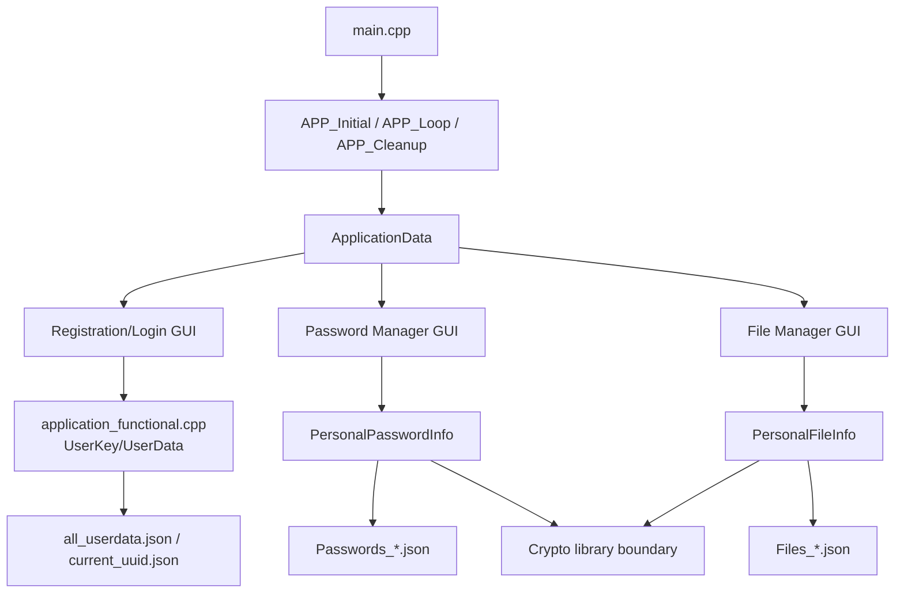
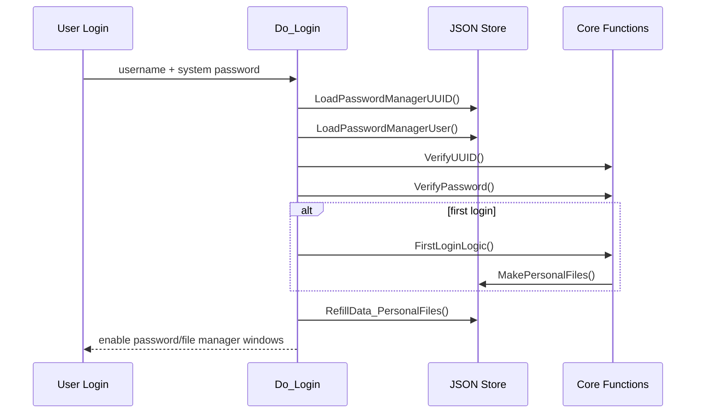
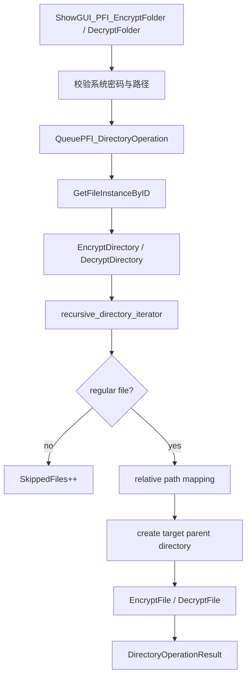

# PasswordManagerGUI 工程论文

## 摘要

PasswordManagerGUI 是一个本地离线的对称密码与数据管理器 GUI 工程。它的目标不是把一个密码算法包装成简单工具，而是在登录身份、个人数据文件、密码文本实例、二进制文件实例、文件夹批处理、即时模式 GUI 和后台任务之间建立一套可维护的工程结构。当前工程使用 C++20、Dear ImGui、GLFW、OpenGL、nlohmann/json 和自研密码库 `TDOM-EncryptOrDecryptFile-Reborn`。业务层把 `UUID + 系统密码` 作为登录后的 token 材料，并由此生成 master key；密码库保存文本密码及实例密钥池，文件库保存文件算法配置并对普通文件或文件夹中的 regular file 逐个加解密。本文从工程视角解释项目为什么这样组织、各模块如何协作、数据怎样落盘、文件夹加密如何复用已有单文件格式，以及当前实现的边界、测试计划和后续演进方向。

**关键词**：C++20；Dear ImGui；本地密码管理器；文件加密；目录递归；JSON 持久化；异步任务；跨平台工程

## 1. 引言

本工程最初的目标是做一个不依赖云服务、不收费、能在本地管理对称安全材料的 Password and Data Manager。单纯保存文本密码只能覆盖一部分需求；用户真正常见的刚需还包括二进制文件、目录树、配置包、私有文档等数据。因此工程需要同时支持两类业务：

- 文本密码实例：有描述、密文、算法链、实例密钥映射，可以在登录后创建、修改、列出、查找和删除。
- 文件数据实例：有算法链配置，可以对一个文件或一个文件夹下的多个文件执行加密/解密。

这两类业务共享登录身份和 master key 材料，但持久化结构不同。密码库需要保存加密后的实例密钥池；文件库只保存算法链配置，不新增每文件 salt、每文件 key pool 或目录 manifest。这样的设计让登录、迁移和恢复模型保持简单：用户带走身份 JSON、个人密码 JSON、个人文件配置 JSON 和加密后的数据文件，在相同确定性密码库行为下就能重新访问数据。

本文不分析自研密码库内部算法安全性。工程层面的重点是调用边界、数据格式、UI 工作流、后台任务与跨平台构建。

## 2. 需求分析

### 2.1 功能需求

1. 用户可以注册本地身份，生成 `current_uuid.json` 和 `all_userdata.json`。
2. 用户可以登录和注销；登录后才显示个人密码库和文件库。
3. 首次登录要自动创建 `PersonalPasswordData/Passwords_*.json` 和 `PersonalFileData/Files_*.json`。
4. 密码库支持创建、修改、列出、按 ID 查找、按描述查找、删除、清空和系统密码变更。
5. 文件库支持创建、列出、删除文件实例，并根据实例算法链加解密单个二进制文件。
6. 文件库支持递归加密/解密文件夹，并保留相对目录结构。
7. 文件夹加密后文件名追加 `.tdom-encrypted`；解密只移除末尾这个后缀。
8. UI 需要显示输入校验、密码校验、任务进度和操作结果。

### 2.2 非功能需求

1. 本地离线运行，不依赖网络服务。
2. 业务层必须尊重跨平台边界，避免把实现相关随机性放进需要确定复现的加解密路径。
3. GUI 线程不应长时间阻塞，文件夹批处理要走后台任务。
4. 退出、注销和临时显示明文后要尽量擦除敏感缓冲。
5. 构建系统要同时照顾 Windows MSVC、Windows MinGW、Linux/macOS，并处理工程路径中方括号对 CMake glob 的影响。

## 3. 工程结构

```text
PasswordManagerGUI/
├─ README.md
├─ docs/
│  ├─ README.md
│  ├─ architecture.md
│  ├─ architecture.en.md
│  ├─ engineering-paper.md
│  └─ engineering-paper.en.md
├─ Project/
│  ├─ CMakeLists.txt
│  ├─ build_win32.bat
│  ├─ generate_visual_studio_project_with_cmake.bat
│  ├─ libs/glfw/
│  └─ source_code/
│     ├─ main.cpp
│     ├─ framework/application.hpp
│     ├─ core/application_data.hpp
│     ├─ core/application_functional.hpp
│     ├─ core/application_functional.cpp
│     ├─ ui/CommonUIComponent.hpp
│     ├─ ui/PasswordManagerGUI.hpp
│     ├─ ui/UIActions.inl
│     ├─ ui/PasswordEncryptionUI.inl
│     ├─ ui/FileEncryptionUI.inl
│     ├─ ui/imgui_layout.inl
│     └─ utility/*.hpp
├─ ImGUI/
├─ ImGuiFileDialog/
├─ json/
└─ TDOM-EncryptOrDecryptFile-Reborn/
```

业务代码集中在 `Project/source_code`。外部目录提供 GUI、文件对话框、JSON 和密码库依赖。`TDOM-EncryptOrDecryptFile-Reborn` 对本工程来说是密码学服务边界，业务层不复制它的算法实现。

## 4. 总体设计



工程采用“框架主循环 + 全局状态 + 业务对象 + JSON 持久化”的结构。`APP_Loop` 每帧渲染所有需要显示的窗口；窗口状态全部在 `ApplicationData` 中。按钮回调不直接运行复杂任务，而是把任务放进 `current_task`，由后台线程取走执行。业务对象负责读写 JSON 和调用密码库。

这种结构符合 Dear ImGui 的特点。ImGui 不保存传统控件对象，所以窗口是否显示、输入框内容、弹窗是否打开、文件路径是否已经选择，都需要由业务侧显式保存。代码中的大量 `ShowPPI_*`、`ShowPFI_*`、`Is*Selected` flag 是即时模式 GUI 的代价，也是当前工程可读性压力的来源。

## 5. 应用生命周期

`main.cpp` 做三件事：

1. 调用 `Logger::Instance().Init()` 开启日志。
2. 安装 `SIGABRT` 和 `std::set_terminate` 处理器，在异常退出时写入 fatal 日志并调用 `APP_Cleanup(CurrentApplicationData)`。
3. 使用 `ScopeGuard` 保证正常执行路径结束时也调用清理。

`framework/application.hpp` 负责真正的应用生命周期：

- `ImGUI_Inital()` 初始化 GLFW、OpenGL、ImGui context、docking、多视口和默认布局。
- `APP_Initial()` 创建后台 `std::jthread`，轮询 `ApplicationData::current_task`。
- `APP_Loop()` 控制 60 FPS 左右的主循环，渲染注册、登录、密码库、文件库和进度条窗口。
- `APP_Cleanup()` 释放 ImGui/GLFW，并擦除多个敏感输入缓冲。

这使入口层保持轻量，框架层集中管理 GUI 生命周期，业务层不需要理解 OpenGL 或 GLFW 的细节。

## 6. 用户身份与 master key 生命周期

### 6.1 注册

注册窗口收集用户名和系统密码。注册动作会生成两份 salt：

- `RandomSalt`：参与 UUID 生成。
- `RandomPasswordSalt`：参与系统密码哈希。

`GenerateUUID()` 使用用户名、随机盐和注册时间生成 UUID。随后 `PasswordAndHash()` 对系统密码加盐哈希，`SavePasswordManagerUser()` 把用户元数据写入 `all_userdata.json`，并把当前 UUID 写入 `current_uuid.json`。

### 6.2 登录

登录通过 `Do_Login()` 完成：



如果用户是首次登录，`FirstLoginLogic()` 会从 UUID 派生个人文件名，并创建：

- `PersonalPasswordData/Passwords_<file_uuid>.json`
- `PersonalFileData/Files_<file_uuid>.json`

随后 `RefillData_PersonalFiles()` 把两个 JSON 反序列化到 `PersonalPasswordObject` 和 `PersonalFileObject`。

### 6.3 Token 与 master key

登录后的核心材料是：

```text
Token = UUID + system password
MasterKey = GenerateMasterBytesKeyFromToken(Token)
```

`GenerateMasterBytesKeyFromToken()` 把 token 分段后交给密码库的 `BuildingKeyStream<256>`，得到 32 字节 master key。密码库和文件库都从这个模型出发，但使用方式不同：

- 密码库：master key 用来解开或重建实例密钥池。
- 文件库：master key 根据文件实例算法链派生多个 subkey。

### 6.4 注销

`Do_LogoutPersonalPasswordInfo()` 是业务状态清理点。它会关闭密码和文件窗口，重置用户对象和业务对象，清空个人文件路径，擦除登录密码缓冲，并清掉文件/文件夹路径选择状态。这个函数保证下次登录不会继承上一个会话的路径、结果弹窗或临时明文。

## 7. 密码库业务设计

`PersonalPasswordInfo` 管理 `PersonalPasswordInstance`：

```text
ID
Description
EncryptedPassword
DecryptedPassword
EncryptionAlgorithmNames
DecryptionAlgorithmNames
HashMapID
```

密码库额外维护两个映射：

- `HashMap_EncryptedSymmetricKey`
- `HashMap_DecryptedSymmetricKey_Hashed`

注册首次登录时，`RegenerateMasterKey()` 会生成一组实例密钥，把实例密钥用 master key 保护后落盘，同时保存明文实例密钥的哈希用于校验。创建密码实例时，实例随机选择一个 `HashMapID`，然后 `RecomputeEncryptedPassword()` 根据算法链把文本密码加密成 Base64 字符串。

密码库主要工作流：

| 工作流 | UI 文件 | 业务函数 |
| --- | --- | --- |
| 创建密码 | `PasswordEncryptionUI.inl` | `Do_CreatePasswordInstance()` -> `CreatePasswordInstance()` |
| 修改密码 | `PasswordEncryptionUI.inl` | `Do_ChangePasswordInstance()` -> `ChangePasswordInstance()` |
| 列出全部 | `PasswordEncryptionUI.inl` | `Do_DecryptionAllPasswordInstance()` -> `ListAllPasswordInstance()` |
| 按 ID 查找 | `PasswordEncryptionUI.inl` | `Do_FindPasswordInstanceByID()` -> `FindPasswordInstanceByID()` |
| 按描述查找 | `PasswordEncryptionUI.inl` | `Do_FindPasswordInstanceByDescription()` -> `FindPasswordInstanceByDescription()` |
| 删除 | `PasswordEncryptionUI.inl` | `RemovePasswordInstance()` / `RemoveAllPasswordInstance()` |
| 系统密码变更 | `PasswordEncryptionUI.inl` | `ChangeInstanceMasterKeyWithSystemPassword()` |

系统密码变更是密码库里最重的流程：它先用旧 token 解出所有密码明文，清空旧实例和旧密钥映射，再用新 token 生成新的实例密钥池，最后重新创建所有密码实例并序列化。这个流程说明系统密码不仅是登录校验值，也是 master key 材料的一部分。

## 8. 文件库业务设计

`PersonalFileInfo` 管理 `PersonalFileInstance`：

```text
ID
EncryptionAlgorithmNames
DecryptionAlgorithmNames
```

文件实例只保存算法链，不保存路径、不保存每文件 key、不保存 salt。GUI 勾选 AES、RC6、SM4、Twofish、Serpent 后，业务层把勾选顺序作为加密链，把反向顺序作为解密链。

### 8.1 subkey 生成

`GenerateFileMultipleSubKeys()` 从登录 token 派生的 master key 出发，为算法链生成多个 256-bit subkey。当前代码有两条路径：

- 当加密/解密算法数量不超过 4 时，把 master key 的 Base64 表示拆成 4 段，经 hash token 路径生成 key stream。
- 其他情况使用 HMAC DRBG 生成固定长度 subkey。

这部分属于业务层对密码库的编排。确定性要求很重要：同一 token、同一算法链、同一密码库实现应得到同一组 subkey。

### 8.2 单文件格式

单文件加密读取整个源文件到 `std::vector<uint8_t>`，计算源文件哈希，执行级联算法链，然后计算密文哈希并写出：

```text
[64 bytes source hash][encrypted bytes][64 bytes encrypted hash]
```

解密反向执行：先拆出头部源哈希、密文字节和尾部密文哈希；验证密文哈希后执行解密链；最后验证明文字节哈希。这个格式给业务层提供了基本完整性检查，也让空文件可以被表示为“两段哈希，中间密文长度为 0”的合法密文。

### 8.3 级联加解密模型

本项目的“级联”不是 AEAD cascade 容器，也不是固定算法套件，而是用户在 GUI 中排列算法顺序。每个文件实例保存这条顺序：


业务层只负责“按名字找到算法，并按实例中保存的顺序调用”。具体每个算法类内部如何定义 CTR 模式接口，由密码库边界提供。

## 9. 文件夹加密/解密实现

文件夹功能的核心原则是复用单文件 API，而不是新增 archive 或容器格式。



实现细节：

- 遍历使用 `std::filesystem::recursive_directory_iterator`，带 `skip_permission_denied`，并通过 `increment(error_code)` 处理遍历错误。
- 通过 `symlink_status()` 跳过 symlink；通过 `status()` 确认只处理 regular file。
- 加密时把 `source/a/b.txt` 映射为 `target/a/b.txt.tdom-encrypted`。
- 解密时只处理末尾带 `.tdom-encrypted` 的文件，输出 `target/a/b.txt`。
- 目标目录不能等于源目录，也不能位于源目录内部，避免输出又被递归遍历。
- `DirectoryOperationResult` 记录成功、失败、跳过数量和路径样本，UI 用结果弹窗展示。

这个实现保持了密钥模型：文件夹中的每个文件都用同一个文件实例算法链和登录 token 处理，不额外生成每文件 salt/key pool。这样做符合当前工程的“登录访问密钥材料，文件配置只存算法链”的模型。

## 10. GUI 层实现

GUI 由几组文件组成：

- `PasswordManagerGUI.hpp`：注册和登录窗口。
- `PasswordEncryptionUI.inl`：密码实例窗口。
- `FileEncryptionUI.inl`：文件和文件夹窗口。
- `CommonUIComponent.hpp`：进度条、密码校验文本、算法勾选组、文件/目录对话框 helper。
- `UIActions.inl`：把按钮操作转换为业务任务。

UI 输入校验通常分两层：

1. 窗口中即时显示校验结果，例如 `VerifyPasswordText(correct_password)`。
2. 点击按钮时再次检查条件，再决定是否调用业务动作。

文件选择和目录选择都封装为模板 helper：

- `FileDialogCallback()` 使用 `GetFilePathName()` 获取具体文件路径。
- `DirectoryDialogCallback()` 使用 `GetCurrentPath()` 获取当前目录路径，并把 filter 设为 `nullptr`。

这种封装把 ImGuiFileDialog 的调用细节从业务窗口中拿出来，减少每个窗口重复处理打开、显示、确认、关闭对话框的代码。

## 11. 后台任务与进度条

后台任务模型由 `ApplicationData` 的几个字段组成：

```text
std::atomic_bool TaskInProgress
std::mutex mutex_task
std::optional<std::function<void()>> current_task
std::optional<std::jthread> background_thread
float progress
float progress_target
float progress_life_time
```

`APP_Initial()` 创建后台线程。线程循环检查 `current_task`，取到任务后执行。UI 侧的 `Do_*` 函数在 `!TaskInProgress` 时把绑定好的函数放入 `current_task`。真正执行时，`DropIfBusy()` 会用 `TaskInProgress.compare_exchange_strong()` 做二次防护，并用 `ScopeGuard` 确保任务结束后清掉 busy flag。

进度条由 `Show_ProgressBar()` 每帧渲染。业务任务调用 `SetProgressTarget()` 改变目标值，UI 层再平滑逼近目标。它不是精确的文件字节进度，而是给用户反馈“后台任务正在推进”的状态条。

## 12. 日志系统

`utility/logger.hpp` 提供单例异步日志器。它的设计点包括：

- 日志级别：DEBUG、INFO、NORMAL、NOTICE、WARNING、ERROR、FATAL。
- mask 控制：是否显示时间、源文件、函数、颜色、tag、message，是否写控制台/文件。
- helper 链式接口：`Logger::Instance().Notice().Log(...)`。
- `std::source_location` 记录调用源信息。
- FATAL 日志同步写入，普通日志进入前台 buffer，再由后台线程批量写到 sink。
- 默认 sink 包括控制台和文件；文件 sink 支持按大小滚动。

日志在本项目中承担两个角色：一是开发期定位 GUI/业务错误，二是在异常退出时记录上下文。它不参与密码材料持久化，不应输出敏感明文。

## 13. 构建与跨平台工程

`Project/CMakeLists.txt` 是主构建入口。它显式添加 `main.cpp`，递归收集 `source_code` 下的 `.h/.hpp/.inl/.cpp`，并加入 ImGui、ImGui backend、ImGuiFileDialog 源文件。

一个关键工程细节是：

```cmake
function(escape_cmake_glob_path output_variable input_path)
    string(REPLACE "\\" "/" escaped_path "${input_path}")
    string(REPLACE "[" "[[]" escaped_path "${escaped_path}")
    set(${output_variable} "${escaped_path}" PARENT_SCOPE)
endfunction()
```

当前工程路径包含方括号，CMake 的 glob 模式会把 `[` 当成模式语法。因此构建脚本需要先转义路径，再 `file(GLOB_RECURSE ...)`。

平台分支：

- Windows + MSVC：使用 Visual Studio generator，链接 bundled MSVC GLFW library，并设置 `/utf-8`、`/bigobj`、`/std:c++20` 相关选项。
- Windows + MinGW：查找 MinGW 兼容的 GLFW library。
- Linux：通过 `pkg-config` 查找 glfw3。
- macOS：链接 OpenGL 和 Cocoa/IOKit/CoreVideo frameworks。

跨平台确定性是这个项目的工程约束。C++ STL 里某些 API 名字一致，但不同实现可能产生不同结果；所以确定性加解密路径不能随便依赖实现相关随机行为。注册 salt、密码 salt、临时 key 这类真随机/硬件随机材料不要求跨机器复现；但只要结果以后要在另一台机器上被解回，就必须让派生路径和算法链保持确定。

## 14. 数据安全边界

当前业务层提供以下保护：

- 登录时校验 UUID 和系统密码。
- 系统密码不直接落盘，落盘的是加盐哈希。
- master key 从 `UUID + 系统密码` 派生，登录后才能访问个人 JSON 对应的密钥材料。
- 密码实例明文只在显示或重加密时临时存在，并在多处显式擦除。
- 单文件密文带源数据哈希和密文哈希，解密前后都做一致性检查。
- logout 和 cleanup 会擦除多个 GUI 缓冲。

边界也很清楚：

- 密码学强度取决于 `TDOM-EncryptOrDecryptFile-Reborn` 的内部实现，本文不替代密码学审计。
- 单文件格式不是 archive，也不是带目录 manifest 的容器。
- 当前单文件实现一次性把整个文件读入内存，超大文件会受内存限制。
- 文件夹操作逐文件继续执行，单个文件失败不会回滚已经成功的文件。

## 15. 功能级实现细节与安全说明

本节按用户能看到的功能逐项说明实现细节。它的目的不是替代源码，而是让后来阅读工程的人知道：每个功能接收什么输入、修改什么状态、落盘什么数据、做了哪些校验、哪些随机性是刻意不可复现的、哪些路径必须保持确定性。

### 15.1 注册功能

注册入口在 `ApplicationUserRegistration()`。GUI 收集 `BufferRegisterUsername` 和 `BufferRegisterPassword`，点击 Register 后会去掉尾部 `'\0'` 填充。如果用户名或密码为空，UI 打开失败弹窗，不写入用户数据。

注册成功路径由以下步骤组成：

1. 调用 `GenerateRandomSalt()` 生成 `RandomSalt`。
2. 再次调用 `GenerateRandomSalt()` 生成 `RandomPasswordSalt`。
3. 调用 `GenerateUUID(username, RandomSalt, RegistrationTime, UUID)`。
4. 调用 `PasswordAndHash(password, RandomPasswordSalt)` 得到系统密码哈希。
5. 调用 `SavePasswordManagerUser()` 写入 `all_userdata.json`，并在新用户情况下写入 `current_uuid.json`。
6. 使用 `memory_set_no_optimize_function<0x00>()` 擦除注册输入缓冲。

这里的 salt 和注册时间属于身份初始化材料，本来就不要求复现。它们的目的不是跨机器确定地生成同一个新用户，而是让一次注册产生新的身份材料。跨平台复现要求主要约束登录后的派生和解密路径，不约束注册时的随机 salt。

`GenerateUUID()` 使用用户名、`RandomSalt` 和 `RegistrationTime` 参与 HMAC 风格计算，哈希模式配置为 `CHINA_SHANG_YONG_MI_MA3`，随后把结果转换成字节并做 Base64 编码。`GenerateStringFileUUIDFromStringUUID()` 进一步把 UUID 压缩成 20 字节再转十六进制，用作个人 JSON 文件名的一部分。这样用户身份和个人文件路径有稳定对应关系，但不会直接用原始 UUID 当文件名。

### 15.2 登录、认证与 timing attack 防护

登录入口在 `ApplicationUserLogin()`，实际业务在 `Do_Login()`。登录过程先修剪输入缓冲，再从 `current_uuid.json` 和 `all_userdata.json` 加载当前用户材料。认证分两部分：

- `VerifyUUID()`：用用户输入的用户名、已保存的 `RandomSalt` 和 `RegistrationTime` 重新计算 UUID，并与 `current_uuid.json` 中的 UUID 比较。
- `VerifyPassword()`：用输入的系统密码和 `RandomPasswordSalt` 重新计算密码哈希，并与 `all_userdata.json` 中保存的 `HashedPassword` 比较。

Timing attack 相关的关键点在 `VerifyPassword()`。代码不会在发现第一个不同字符时提前返回，而是在哈希长度一致时遍历完整哈希字符串并累积比较结果：

```cpp
bool isSame = true;
for(size_t Index = 0; Index < HashedPassword.size(); ++Index)
{
    isSame &= ~static_cast<bool>(HashedPassword[Index] ^ CurrentUserData.HashedPassword[Index]);
}
return isSame;
```

这属于工程层的 constant-work digest comparison：正常数据下，BLAKE2-512 十六进制哈希长度固定，比较会覆盖整个 digest，不会因为首个 mismatch 暴露“前缀匹配长度”。代码在长度不一致时先返回 false，这是格式边界处理；保存的密码哈希本应是固定长度，长度异常更多代表数据文件损坏或格式不合法，而不是用户密码字符猜测路径。严格密码学意义上的 constant-time 还会受编译器优化、运行平台、字符串布局等影响，因此这里应表述为“避免早停比较”，而不是夸大成形式化证明过的常量时间原语。

登录成功后，如果 `IsFirstLogin` 为 true，程序调用 `FirstLoginLogic()` 创建个人密码 JSON 和个人文件 JSON。随后 `RefillData_PersonalFiles()` 反序列化两个业务对象，并打开密码库和文件库主窗口。登录流程结束时会擦除 `BufferLoginPassword`，避免系统密码继续留在登录输入缓冲中。

### 15.3 首次登录与个人数据文件

首次登录的意义是把“用户身份”落到“个人数据文件”。`FirstLoginLogic()` 使用当前 UUID 派生 `UniqueFileName`，然后生成：

```text
PersonalPasswordData/Passwords_<UniqueFileName>.json
PersonalFileData/Files_<UniqueFileName>.json
```

`MakePersonalFiles()` 会先确保父目录存在，再创建两个文件。密码 JSON 初始化时会调用 `RegenerateMasterKey()` 生成密码实例密钥池；文件 JSON 初始化时只序列化一个空的 `PersonalFileInfo`，因为文件实例不保存 per-file key pool。

`SavePasswordManagerUser()` 会把 `PersonalPasswordInfoFileName` 和 `PersonalDataInfoFileName` 写回 `all_userdata.json`。这很重要：登录恢复时不需要扫描目录猜文件名，而是从用户元数据直接找到个人数据文件。

### 15.4 注销与敏感状态清理

注销由 `Do_LogoutPersonalPasswordInfo()` 完成。它不是单纯把 `IsUserLogin` 设为 false，而是清理整套会话状态：

- 关闭 `ShowGUI_PersonalPasswordInfo` 和 `ShowGUI_PersonalFileInfo`。
- 重置 `UserKey`、`UserData`、`PersonalPasswordObject`、`PersonalFileObject`。
- 清空 `PersonalPasswordInfoFilePath` 和 `PersonalDataInfoFilePath`。
- 擦除 `BufferLoginPassword`。
- 关闭密码库和文件库所有子窗口。
- 清空单文件和文件夹选择路径。
- 清空文件夹操作错误消息和上一次目录操作结果。

这个设计避免了两个风险：一是下一个登录用户看到上一个用户的 UI 状态；二是后台结果弹窗、路径选择、临时明文等跨会话残留。

### 15.5 密码实例创建

密码实例创建窗口会校验三类输入：

- 系统密码必须通过 `VerifyPassword()`。
- 新密码文本不能全是 `'\0'`。
- 至少选择一个算法。

算法选择由 `ShowEncryptionAlgorithmGroup()` 读取 AES、RC6、SM4、Twofish、Serpent 的 checkbox。创建动作会把勾选顺序放入 `ShowPPI_EncryptionAlgorithms`，再用 `std::reverse_copy()` 生成 `ShowPPI_DecryptionAlgorithms`。因此用户看到的是“加密顺序”，解密顺序由业务层自动反向保存。

`Do_CreatePasswordInstance()` 通过后台任务调用 `PersonalPasswordInfo::CreatePasswordInstance()`。实例 ID 使用当前最后一个 ID 加一；`HashMapID` 从已有实例密钥池中选择；`RecomputeEncryptedPassword()` 解出对应实例密钥、校验实例密钥哈希，然后按算法链加密新密码并 Base64 编码。创建完成后立刻序列化 `Passwords_*.json`，并清空新密码、描述和临时算法数组。

这里有两种随机性：

- 实例密钥池由首次登录或系统密码迁移时生成，属于需要持久化保护的秘密材料。
- 新密码实例选择哪个 `HashMapID` 可以是不确定的，因为 `HashMapID` 会随实例落盘；后续解密不依赖重新随机选择。

### 15.6 密码实例修改

修改窗口输入目标 ID、描述、新密码和算法选择，并有 `ShowPPI_ChangeEncryptedPassword` 开关。这个开关决定是否重算密文密码。如果只改描述，业务层可以保留原密文和算法链；如果修改密码或算法链，就必须重新生成密文。

`Do_ChangePasswordInstance()` 的保护条件包括系统密码正确、目标新密码非空、算法链非空。业务函数 `ChangePasswordInstance()` 先按 ID 查找实例，找不到则返回 false。找到后更新描述、算法链，并在需要时调用 `RecomputeEncryptedPassword()`。成功后序列化 JSON，并让 `IsPasswordInfoTemporaryValid` 失效，避免列表窗口继续显示旧的解密缓存。

### 15.7 密码实例列出与查找

列出全部密码实例时，UI 先要求输入系统密码。只有密码正确时，`Do_DecryptionAllPasswordInstance()` 才会调用 `ListAllPasswordInstance(Token)`。该函数逐个实例调用 `RecomputeDecryptedPassword()`，把临时明文写回内存对象供 UI 显示。

这类功能的安全边界是“显示需要临时明文”。因此窗口隐藏或取消 `List All` 时，代码会遍历实例，把 `DecryptedPassword` 用 `memory_set_no_optimize_function<0x00>()` 擦除并清空。按 ID 查找和按描述查找则把格式化结果写到固定大小 buffer，关闭或隐藏时清空对应 buffer。

查找功能不修改 JSON；它们只是临时解密并显示结果。删除、修改、创建才会触发序列化。

### 15.8 密码实例删除与清空

删除单个密码实例要求输入系统密码。按钮点击后，UI 调用 `VerifyPassword()`，只有密码正确且 `RemovePasswordInstance(ID)` 返回 true 时才序列化 JSON。删除成功后，代码会重新整理剩余实例 ID，使 ID 与当前 vector 顺序保持一致。

清空全部密码实例同样要求系统密码正确。成功后调用 `RemoveAllPasswordInstance()` 并序列化。这里删除的是密码实例，不是用户身份，也不是 `HashMap_EncryptedSymmetricKey` 密钥池本身。密钥池继续存在，后续仍可创建新的密码实例。

### 15.9 系统密码变更

系统密码变更是最敏感的业务流程，因为系统密码参与 token，也就参与 master key。窗口要求输入旧系统密码、确认旧系统密码和新系统密码。

`Do_ChangeInstanceMasterKeyWithSystemPassword()` 做了几层判断：

- 旧系统密码必须通过 `VerifyPassword()`。
- 确认旧密码必须与当前登录密码一致。
- 新密码不能与旧密码相同。

通过后，业务层调用 `ChangeInstanceMasterKeyWithSystemPassword(FilePath, OldToken, NewToken)`。该函数先用旧 token 解出所有现有密码明文，并保存描述和算法链；然后清空旧实例与旧密钥映射；再用新 token 生成新的密钥池；最后逐条重新创建密码实例并序列化。中间的旧明文和实例临时明文会被显式擦除。

这个流程目前主要覆盖密码库。文件库的文件加密材料也是从 `UUID + 系统密码` 派生的，所以“改系统密码后旧文件是否还能用新密码解密”不是自动成立的。如果未来要支持旧文件随系统密码迁移，需要设计文件密钥迁移层，不能只改 UI。

### 15.10 文件实例创建、列出与删除

文件实例不同于密码实例。它只保存算法链：

```text
ID
EncryptionAlgorithmNames
DecryptionAlgorithmNames
```

创建文件实例不生成 secret key，也不绑定具体文件路径。`CreateFileInstance()` 的 `Token` 参数目前不参与内部逻辑；实例只是告诉后续文件操作“按什么算法顺序处理”。因此 `Files_*.json` 保持很轻：它是文件加密配置表，不是密钥数据库。

列出文件实例只展示 ID 和算法链。删除文件实例删除的是配置，不会删除已经生成的 `.tdom-encrypted` 文件，也不会擦除用户磁盘上的源文件或目标文件。删除后同样会重新整理 ID，保证通过 ID 查找时与当前列表一致。

### 15.11 单文件加密

单文件加密窗口要求：

- 系统密码正确。
- 源文件路径已选择。
- 目标加密文件路径已选择。
- 文件实例 ID 能找到。

`FileDialogCallback()` 负责选择具体文件路径。加密按钮通过 `VerifyPassword()` gate 后，调用 `PersonalFileInfo::EncryptFile(Token, Instance, SourceFilePath, TargetEncryptedFilePath)`。

`EncryptFile()` 内部流程：

1. 用 `std::filesystem::is_regular_file()` 确认源路径是 regular file。
2. 确认加密算法链和解密算法链都非空且长度一致。
3. 以二进制方式读入整个文件。
4. 计算源文件数据的 SHA3-512 哈希。
5. 用 token 派生 master key。
6. 根据文件实例算法链生成多个 subkey。
7. 按 `EncryptionAlgorithmNames` 顺序逐个调用对应算法的 CTR stream 函数。
8. 计算密文数据的 SHA3-512 哈希。
9. 写出 `[source hash][cipher bytes][cipher hash]`。
10. 擦除 master key 和 subkey。

空文件不会被拒绝。空文件的 `FileByteData` 为空，算法链循环被跳过，但源哈希和密文哈希仍会写入，因此输出是合法的 128 字节结构。

### 15.12 单文件解密

单文件解密窗口要求系统密码正确、源加密文件路径已选择、目标解密文件路径已选择、文件实例 ID 有效。解密按钮调用 `DecryptFile()`。

`DecryptFile()` 的关键防护是两段哈希验证：

1. 文件总长度必须至少 128 字节，否则不可能包含两个 SHA3-512 哈希。
2. 读取前 64 字节作为源哈希。
3. 读取中间部分作为密文数据。
4. 读取最后 64 字节作为密文哈希。
5. 先重新计算密文数据哈希，与尾部哈希比较；失败则不解密。
6. 派生 master key 和 subkey。
7. 按 `DecryptionAlgorithmNames` 执行反向链。
8. 重新计算明文哈希，与头部源哈希比较；失败则不写出。
9. 写出解密文件。
10. 擦除 master key 和 subkey。

这个设计把“密文是否被破坏”和“解密结果是否回到原始数据”分成两个检查点。它不是 AEAD tag，但在当前文件格式里承担完整性检测和错误密码/错误实例配置检测的职责。

### 15.13 文件夹加密

文件夹加密是批处理入口，不改变单文件格式。UI 层先检查系统密码、源目录、目标目录，并用 `IsSameOrSubPathForUI()` 拒绝目标目录等于源目录或位于源目录内部。核心层 `EncryptDirectory()` 会再次检查同样的目录关系，避免只靠 UI 防护。

实际处理在后台任务中运行：

- `QueuePFI_DirectoryOperation()` 复制 token、文件实例 ID、源目录和目标目录。
- 后台线程先通过 `GetFileInstanceByID()` 找到文件实例。
- 然后调用 `EncryptDirectory()`。

`EncryptDirectory()` 使用 `recursive_directory_iterator` 递归遍历源目录，不跟随链接。每个目录项会先看 `symlink_status()`，symlink 直接跳过；再用 `status()` 判断是否 regular file。目录本身继续遍历，special file、权限错误、状态错误都会计入 skipped。

对 regular file，代码计算相对路径：

```text
relative = relative(source_file, source_dir)
target_file = target_dir / relative
target_file += ".tdom-encrypted"
```

随后创建目标父目录，并调用现有 `EncryptFile()`。单个文件失败只增加 `FailedFiles`，不会停止整个目录任务。结果通过 `DirectoryOperationResult` 汇总，并在 UI 弹窗中显示成功、失败、跳过数量以及路径样本。

### 15.14 文件夹解密

文件夹解密与加密对称，但多一个后缀规则：只处理文件名末尾带 `.tdom-encrypted` 的 regular file。没有这个后缀的 regular file 不报失败，而是计入 skipped，因为它们可能是用户放在目录里的旁路文件或说明文件。

路径映射是：

```text
source/a/b.txt.tdom-encrypted -> target/a/b.txt
```

`StripEncryptedFileExtension()` 只移除末尾完整后缀，不会删除文件名中间出现的同名字串。如果移除后文件名为空，也会跳过。随后调用 `DecryptFile()`，继承单文件解密的两段哈希验证。

### 15.15 文件与目录路径安全

路径层的主要风险是“输出目录被递归遍历回输入”。如果用户把目标目录设成源目录内部，程序一边生成新密文，一边遍历到刚生成的文件，就可能无限扩张或重复处理。因此 UI 层和核心层都有 `IsSameOrSubPath` 判断。

另一个风险是 symlink/reparse/special file。目录任务不跟随链接，也不处理非 regular file。这个策略牺牲了一些“完整备份目录”的能力，但避免了跨目录边界写入、循环链接、设备文件等问题，更符合加密普通用户数据文件的业务目标。

### 15.16 后台任务、重入与失败隔离

本工程不是多任务队列，而是单后台 worker + 单任务槽。UI 准备任务时写入 `current_task`；worker 取出后执行。`DropIfBusy()` 用 `TaskInProgress` 防止同一时间进入两个业务任务。如果当前已有任务，新任务会被跳过并写 warning 日志。

这种模型适合当前 GUI：文件夹加密、密码列表解密、系统密码迁移都不应该并发执行。失败隔离由业务函数自己负责。例如文件夹批处理中，一个文件失败不会影响后续文件；但系统密码迁移这类整体性任务失败就应该停止并报告。

### 15.17 日志与敏感信息边界

日志系统会记录路径、任务状态、错误原因和源码位置。工程约定上，不应把系统密码、实例明文密码、master key、subkey、实例密钥明文写入日志。当前业务代码里的日志主要用于文件打开失败、哈希失败、算法不支持、登录失败类型和任务状态。

FATAL 日志同步写出，普通日志异步写出。异常退出路径会先写 fatal，再调用 cleanup。这样设计是为了让崩溃时尽量保留工程诊断信息，同时不让日志成为敏感数据泄露通道。

### 15.18 跨平台确定性边界

工程里需要区分两类随机性：

- 不可复现随机性：注册 salt、密码 salt、实例密钥池生成、新实例选择 `HashMapID` 等。这些结果会落盘或只用于创建新材料，不要求另一台机器重新生成同一随机值。
- 必须复现的确定性派生：登录后从 `UUID + 系统密码` 到 master key，从 master key 到文件 subkey，从算法链到加解密顺序。这些路径必须在目标平台上保持一致，否则用户迁移系统后会无法解密旧数据。

因此工程论文和代码注释都应避免一句“STL API 是跨平台”就结束判断。某些 API 接口相同但实现不同，尤其随机分布或 PRNG 行为，不能随便放进确定性解密路径。当前文件夹功能没有新增随机性，只是复用单文件加解密，所以没有扩大这类风险。

## 16. 测试计划

推荐按四组测试覆盖当前业务层。

### 15.1 登录与持久化

- 注册新用户，确认 `current_uuid.json` 和 `all_userdata.json` 生成。
- 首次登录后确认 `PersonalPasswordData` 和 `PersonalFileData` 下两个个人 JSON 生成。
- 注销后再次登录，确认窗口状态和业务对象不会继承旧会话临时状态。
- 修改系统密码后，旧密码不能登录，新密码可以登录，已有密码实例仍能解出。

### 15.2 密码库

- 创建 AES 单算法密码实例。
- 创建多算法级联密码实例。
- 列出全部、按 ID 查找、按描述查找，确认解出的明文一致。
- 修改描述、修改明文、删除单条、删除全部。
- 错误系统密码不能执行受保护操作。

### 15.3 单文件与文件夹

- 对文本文件、二进制文件、空文件执行单文件加解密，逐字节比较。
- 对嵌套目录执行文件夹加密，确认相对结构保留，文件名追加 `.tdom-encrypted`。
- 解密文件夹后逐字节比较全部 regular file。
- 目标目录不存在时自动创建。
- 源目录内包含无后缀文件、特殊文件、symlink/reparse point 时确认 skipped 计数。
- target 等于 source 或位于 source 内部时拒绝操作。

### 15.4 构建与平台

- Windows MSVC 生成 Visual Studio 17 2022 工程。
- Windows MinGW 构建。
- Linux/macOS 至少完成 CMake configure。
- 路径包含方括号时确认 CMake glob 能正常收集源码。

## 17. 当前限制与后续演进

1. 文件加密目前一次性读入内存。后续可以把单文件格式改成分块流式处理，但需要保持哈希验证和旧格式迁移策略。
2. ImGui flag 很多，代码臃肿。后续可以把 PPI/PFI 状态拆成子结构，例如 `PasswordUIState`、`FileUIState`、`FolderOperationState`。
3. 目录操作没有 manifest。当前设计刻意保持逐文件模型；如果未来需要保留空目录、权限、时间戳或原始文件名策略，可以考虑单独 manifest。
4. 文件库系统密码变更目前主要影响密码实例密钥池；文件加密依赖 token 派生的 master key，因此改变系统密码会改变后续文件解密材料。若要支持“改系统密码后旧文件仍可解”，需要引入文件密钥迁移或稳定文件密钥保护层，这属于单独设计。
5. 日志系统不应记录敏感明文，后续可以加更严格的敏感字段审查约定。
6. 密码库内部实现应在外部项目中独立维护和审计，GUI 工程只固定集成边界和业务格式。

## 18. 结论

PasswordManagerGUI 的核心工程价值在于把本地身份、个人数据文件、密码文本、二进制文件、文件夹批处理和即时模式 GUI 组织成一个可继续扩展的应用框架。它没有把文件夹加密做成复杂容器，而是复用单文件格式和文件实例算法链，从而降低了新增功能对既有密钥模型的破坏。当前实现已经形成清晰边界：GUI 负责输入与反馈，`ApplicationData` 承担运行状态，`application_functional.*` 承担业务规则，JSON 文件承担持久化，自研密码库承担密码学原语。下一阶段的重点应是扩大测试覆盖、改善 UI 状态组织、评估大文件流式处理，并继续在外部密码库中维护确定性和跨平台一致性。
